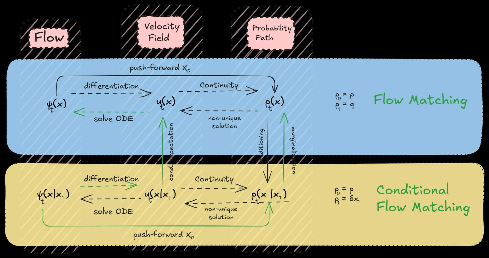
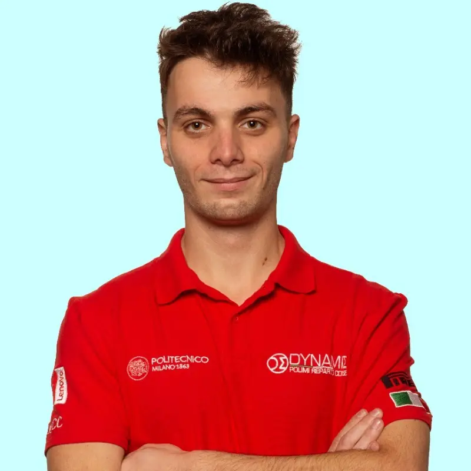

Flow Matching is a cutting-edge framework in generative modeling that has pushed the boundaries in fields like image and speech generation, and now, robotics. By learning smooth transformations—flows—from simple noise distributions to complex target distributions, Flow Matching enables the creation of continuous data in a way that's both efficient and scalable.

### The Core Intuition

At its heart, Flow Matching involves training a neural network to model a velocity field that defines how data points transition over time. Imagine starting with random noise and, through a continuous process, gradually shaping it into precise robot joint movements. This approach is fundamentally different from traditional methods that directly predict actions, which can lead to jerky or unrealistic movements.

By interpolating between a source distribution (like noise) and a target distribution (desired movements), Flow Matching produces smooth trajectories. This is particularly valuable in robotics, where generating fluid, natural movements enhances performance and integration into real-world environments.

Caption: Flow Matching Diagram

Flow Matching's key components and their interactions: A velocity field defines the flow that generates probability paths. The framework simplifies complex flows with challenging boundary conditions (top) into more manageable conditional flows (middle). Arrows indicate dependencies. The velocity field is learned through loss functions, primarily using Conditional Flow Matching (CFM) loss in practice.

Flow Matching Problem: Find u t θ \mathbf{u}_t^\theta u t θ ​ generating p t p_t p t ​ , with p 0 = p p_0 = p p 0 ​ = p and p 1 = q p_1 = q p 1 ​ = q .

### Theoretical Foundations of Flow Matching

Flow Matching is grounded in the concept of learning a velocity field (also known as a vector field). This velocity field defines a flow ψ t \psi_t ψ t ​ by solving an ordinary differential equation (ODE) through simulation. Essentially, a flow is a deterministic, time-continuous, bijective transformation of the d-dimensional Euclidean space R d \mathbb{R}^d R d .

The primary objective is to construct a flow that transforms a sample X 0 ∼ p \mathbf{X_0} \sim \mathbf{p} X 0 ​ ∼ p from a source distribution p \mathbf{p} p into a target sample X 1 = ψ 1 ( X 0 ) \mathbf{X_1} = \psi_1(\mathbf{X_0}) X 1 ​ = ψ 1 ​ ( X 0 ​ ) such that X 1 ∼ q \mathbf{X_1} \sim \mathbf{q} X 1 ​ ∼ q , where q \mathbf{q} q is the desired target distribution.

More specifically, the goal is to find the parameters of the flow defined as a learnable velocity u t θ \mathbf{u}_t^\theta u t θ ​ that generates intermediate distributions p t \mathbf{p}_t p t ​ with p 0 = p \mathbf{p}_0 = \mathbf{p} p 0 ​ = p and p 1 = q \mathbf{p}_1 = \mathbf{q} p 1 ​ = q for each t t t in ( 0 , 1 ) (0,1) ( 0 , 1 ) . This ensures a smooth transition from the source to target distribution.

The Flow Matching Loss : The core of FM is the Flow Matching loss. It measures the difference between the learned velocity field and the ideal velocity field that would perfectly generate the probability path. By minimizing this loss, the model learns to guide the source distribution along the desired path towards the target data distribution.

Flow models, introduced to the machine learning community as Continuous Normalizing Flows (CNFs), initially involved maximizing the likelihood of training examples by simulating and differentiating the flow during training. However, due to computational challenges, subsequent research focused on learning these flows without simulation, leading to modern Flow Matching algorithms.

The Flow Matching framework involves three key steps:

Probability Path Selection : Choose a probability path p t p_t p t ​ that smoothly interpolates between the source distribution p p p and the target distribution q q q .

Conditional Simplification : To make learning the velocity field easier, FM employs a trick called conditioning. Instead of directly learning a complex velocity field for the entire dataset, it breaks the problem down into simpler conditional velocity fields. Each conditional velocity field focuses on transforming the source noise into a specific data sample from the dataset.

Velocity Field Training : Learn a velocity field that acts as a guide for transforming source samples into target samples. Think of this field as a set of directions at each point in space, showing how samples should "flow" from noise to meaningful data. The field is typically implemented as a neural network and trained to generate the desired probability path ψ t \psi_t ψ t ​ through:

- Learning the optimal direction and speed for each point in the data space

- Ensuring smooth transitions between the source noise distribution and target data distribution

- Minimizing the difference between the predicted flow and the ideal transformation path

In essence, FM leverages the concept of smoothly transforming a simple distribution into a complex one by learning the dynamics of this transformation through velocity fields and a tailored loss function. This approach has proven successful in generating high-quality samples across various domains, making it a versatile tool for generative modeling.

### Loss Function Details

The Flow Matching (FM) loss function is central to training the model, as it measures how well the learned velocity field aligns with the ideal velocity field along the probability path from the source to the target distribution.

The FM loss is defined as:

Where:

- L FM ( θ ) L_{\text{FM}}(\theta) L FM ​ ( θ ) is the flow matching loss function.

- θ \theta θ represents the parameters of the learnable velocity field u t θ \mathbf{u}_t^\theta u t θ ​ .

- X t \mathbf{X}_t X t ​ is a sample from the intermediate distribution p t p_t p t ​ at time t t t .

- D ( ⋅ , ⋅ ) D(\cdot, \cdot) D ( ⋅ , ⋅ ) is a dissimilarity measure, such as the squared Euclidean norm.

This loss function encourages the learned velocity field u t θ \mathbf{u}_t^\theta u t θ ​ to match the ideal velocity field u t \mathbf{u}_t u t ​ , effectively guiding samples along the desired probability path.

However, computing the ideal velocity field u t \mathbf{u}_t u t ​ for the entire dataset is often impractical due to computational constraints. To overcome this, we utilize Conditional Flow Matching (CFM) , which simplifies the problem by conditioning on individual data points.

The CFM loss is formulated as:

Where:

- Z \mathbf{Z} Z is the conditioning variable (e.g., a specific data sample or observation).

- X t \mathbf{X}_t X t ​ is now sampled from the conditional distribution p t ( ⋅ ∣ Z ) p_t(\cdot \mid \mathbf{Z}) p t ​ ( ⋅ ∣ Z ) .

- u t ( X t ∣ Z ) \mathbf{u}_t(\mathbf{X}_t \mid \mathbf{Z}) u t ​ ( X t ​ ∣ Z ) is the ideal conditional velocity field.

By minimizing the CFM loss, the model learns to approximate the ideal conditional velocity field, making the training process more efficient and scalable.

#### Advantages of Conditional Flow Matching:

- Computational Efficiency : Conditioning reduces the complexity of computing the ideal velocity field, allowing for feasible training on large datasets.

- Improved Learning : The model focuses on learning transformations relevant to specific conditions, leading to better performance.

- Scalability : CFM is suitable for high-dimensional data, such as robotic action sequences, enhancing applicability in complex domains.

In essence, the CFM loss serves as a continuous feedback mechanism, refining the model's velocity field to closely follow the desired probability path. This results in the generation of realistic and high-quality data samples that align with the target distribution.

### Probability Density Path

The Probability Density Path p t p_t p t ​ is a fundamental concept in Flow Matching. It represents a smooth, continuous transformation from a simple source distribution (like random noise) at time t = 0 t=0 t = 0 to the complex target distribution (your data) at time t = 1 t=1 t = 1 . Think of it as a journey where noise gradually becomes meaningful data as time progresses.

Instead of attempting to model the entire data distribution at once, Flow Matching constructs this path by combining multiple conditional probability paths . Each conditional path focuses on transforming a specific noise sample ( x 0 x_0 x 0 ​ ) into a target data point ( x 1 x_1 x 1 ​ ), making the learning process more manageable.

#### Defining the Conditional Probability Path

Here's how you can define the conditional probability path:

Choose a Conditional Flow : An affine conditional flow is commonly used due to its simplicity:

This function ψ t \psi_t ψ t ​ blends the noise sample x 0 x_0 x 0 ​ and the target data point x 1 x_1 x 1 ​ according to time-dependent parameters α t \alpha_t α t ​ and σ t \sigma_t σ t ​ .

Select a Scheduler for α t \alpha_t α t ​ and σ t \sigma_t σ t ​ :

These parameters determine how noise and data mix over time. You can choose between:

Linear Schedule :

This schedule is simple and straightforward.

Variance Preserving Schedule :

This approach often leads to better sample quality.

Other options include cosine or polynomial schedules, tailored to your specific data characteristics.

Compute the Intermediate Sample x t x_t x t ​ :

At any given time t t t , compute:

This gives you a point on the conditional probability path, representing the state of the sample at time t t t as it transitions from noise to data.

#### Aggregating Conditional Paths

By considering all possible pairs of x 0 x_0 x 0 ​ and x 1 x_1 x 1 ​ , we aggregate these conditional paths to form the overall probability density path:

Where:

- p t ∣ Z ( x ∣ z ) p_{t \mid Z}(x \mid z) p t ∣ Z ​ ( x ∣ z ) is the conditional probability path given data point z z z .

- p Z ( z ) p_Z(z) p Z ​ ( z ) is the distribution of your data (approximated by your dataset).

This equation effectively averages over all conditional paths, weighted by the probability of each data point, creating a comprehensive path from the source to the target distribution.

### Training Process in Detail

During training, we use a clever trick called "conditional flow matching." Instead of trying to learn the entire path directly, we:

- Sample a target action x 1 x_1 x 1 ​ from our training data

- Sample a noise vector x 0 x_0 x 0 ​ from our starting distribution

- Pick a random time τ τ τ between 0 and 1

- Create an interpolated point: x τ = τ x 1 + ( 1 − τ ) x 0 x_τ = τx_1 + (1-τ)x_0 x τ ​ = τ x 1 ​ + ( 1 − τ ) x 0 ​

The model then learns to predict the correct direction this point should move by minimizing the loss:

L ( θ ) = E τ , x 0 , x 1 ∥ v θ ( x τ , c , τ ) − x 1 − x 0 1 − τ ∥ 2 L(θ) = E_{τ,x_0,x_1} \|v_θ(x_τ,c,τ) - \frac{x_1 - x_0}{1-τ}\|^2 L ( θ ) = E τ , x 0 ​ , x 1 ​ ​ ∥ v θ ​ ( x τ ​ , c , τ ) − 1 − τ x 1 ​ − x 0 ​ ​ ∥ 2

### Key Works and Citations

- Chen et al. (2018) : Neural Ordinary Differential Equations.

- Grathwohl et al. (2018) : FFJORD: Free-form Continuous Dynamics for Scalable Reversible Generative Models.

- Lipman et al. (2022) : Flow Matching for Generative Modeling.

- Albergo and Vanden-Eijnden (2022) : Building Normalizing Flows with Stochastic Interpolants.

- Neklyudov et al. (2023) : A More General Framework for Generative Modeling via Paths on Probability Manifolds.

- Lipman et al. (2024) : Flow Matching Guide and Code.

## Application to Robotics

In robotics, we often need to translate discrete commands ("pick up the cup") into continuous, smooth motions. Flow matching excels here because:

- The conditioning information c c c can include both discrete commands and continuous state information (joint angles, images)

- The generated actions are naturally smooth due to the continuous nature of the flow

- The model can capture complex relationships between multiple joints and time steps

For example, in the π0 model ( Physical Intelligence ) , they use flow matching to generate "action chunks" - sequences of continuous controls that accomplish a desired motion.

The process works like this:

- The model receives a discrete command and current robot state

- It initializes a sequence of random noise vectors

- The flow matching process gradually denoises these vectors into a coherent sequence of actions

- Each action in the sequence is conditioned on both the original command and the predicted states from previous actions

The mathematical form for generating these action sequences is:

A t + δ = A t + δ v θ ( A t , c ) A_{t+δ} = A_t + δv_θ(A_t, c) A t + δ ​ = A t ​ + δ v θ ​ ( A t ​ , c )

where A t A_t A t ​ represents the entire action sequence at time t t t , and we iteratively refine it using small steps δ δ δ until we reach our final sequence.

### Advantages Over Traditional Approaches

This approach offers several key benefits:

- Smoothness : The continuous nature of flow matching naturally produces smooth, physically plausible movements

- Uncertainty Handling : The stochastic initialization allows the model to capture multiple valid ways of executing a command

- Long-horizon Planning : By generating entire action sequences at once, the model can plan coherent multi-step behaviors

### The Role of Vector Fields

The learned vector field v θ v_θ v θ ​ is crucial - it captures the complex relationships between robot state, commands, and appropriate actions. At each point in the generation process, it provides a direction that moves the noise distribution closer to valid robot actions while maintaining physical constraints and task requirements.

This field is implemented as a neural network that takes current state, conditioning information, and time as inputs, producing a direction vector as output. The architecture typically includes:

- Encoders for processing visual and state information

- Cross-attention mechanisms for incorporating command information

- Multiple layers for capturing complex dynamics

- Output layers scaled appropriately for robot control signals

Through careful training on diverse datasets, this network learns to capture the underlying structure of robot movements, enabling fluid and purposeful action generation from discrete commands.

## Flow Matching in Robotics: From Theory to Implementation

Flow matching transforms the challenging problem of continuous robot control into a gradual denoising process. Here's a detailed explanation of how it works in practice:

### Core Implementation Principles

The foundation starts with modeling robot actions as multi-dimensional vectors representing joint positions, velocities, or torques. For a robot with n n n degrees of freedom controlling for H H H timesteps, we work with action chunks A ∈ R n × H A \in \mathbb{R}^{n\times H} A ∈ R n × H . A 7-DOF robot arm generating 1-second trajectories at 50Hz would use H = 50 H=50 H = 50 , resulting in a 350-dimensional action space.

The flow matching process transforms random noise into these action trajectories through a learned vector field. This is implemented as a neural network v θ v_\theta v θ ​ that takes three inputs:

- Current noisy action sequence A τ A_\tau A τ ​

- Robot observations o o o (images, joint states, etc.)

- Time parameter τ \tau τ indicating noise level

The network architecture typically consists of:

class FlowMatchingNetwork ( nn . Module ) : def __init__ ( self , action_dim , obs_dim , hidden_dim ) : super ( ) . __init__ ( ) self . obs_encoder = nn . Sequential ( nn . Linear ( obs_dim , hidden_dim ) , nn . ReLU ( ) , nn . Linear ( hidden_dim , hidden_dim ) ) self . time_encoder = nn . Sequential ( SinusoidalPosEmb ( dim = hidden_dim ) , nn . Linear ( hidden_dim , hidden_dim ) ) self . action_encoder = nn . Sequential ( nn . Linear ( action_dim , hidden_dim ) , nn . ReLU ( ) , nn . Linear ( hidden_dim , hidden_dim ) ) self . decoder = nn . Sequential ( nn . Linear ( hidden_dim * 3 , hidden_dim ) , nn . ReLU ( ) , nn . Linear ( hidden_dim , action_dim ) ) def forward ( self , x_t , obs , t ) : h_obs = self . obs_encoder ( obs ) h_time = self . time_encoder ( t ) h_action = self . action_encoder ( x_t ) h = torch . cat ( [ h_obs , h_time , h_action ] , dim = - 1 ) return self . decoder ( h )

During training, we sample action sequences from demonstration data and gradually add noise. The loss function teaches the network to predict the correct denoising direction:

def flow_matching_loss ( model , actions , obs , device ) : batch_size = actions . shape [ 0 ] # Sample random noise and timepoints noise = torch . randn_like ( actions ) . to ( device ) t = torch . rand ( batch_size , 1 ) . to ( device ) # Create noisy actions x_t = t * actions + ( 1 - t ) * noise # Target denoising direction target = ( actions - noise ) / ( 1 - t ) # Predict denoising direction pred = model ( x_t , obs , t ) return F . mse_loss ( pred , target )

For inference, we integrate the vector field using a simple Euler scheme:

def generate_actions ( model , obs , steps = 10 ) : # Start from random noise x = torch . randn ( 1 , action_dim ) . to ( device ) dt = 1 . 0 / steps # Gradually denoise for i in range ( steps ) : t = torch . tensor ( [ i * dt ] ) . to ( device ) dx = model ( x , obs , t ) * dt x = x + dx return x

This implementation allows for:

- Smooth, continuous action generation

- Natural handling of multi-modal action distributions

- Principled uncertainty estimation

- Efficient parallel processing of action sequences

The key insight is that by learning a vector field rather than directly predicting actions, we obtain naturally smooth and physically plausible trajectories while maintaining the flexibility to capture complex behaviors.

@article {federicosarrocco2024, author = {Federico Sarrocco}, title = {Flow Matching Explained: From Noise to Robot Actions}, year = {2024}, month = {November}, day = {8}, url = {https://federicosarrocco.com/blog/flow-matching} }

### About the author

Caption: Federico Sarrocco

#### Federico Sarrocco
