# An introduction to Flow Matching · Cambridge MLG Blog

Caption: Representative image

## An introduction to Flow Matching

diffusion model generative modelling normalising flows

## Introduction

Flow matching (FM) is a recent generative modelling paradigm which has rapidly been gaining popularity in the deep probabilistic ML community. Flow matching combines aspects from Continuous Normalising Flows (CNFs) and Diffusion Models (DMs) , alleviating key issues both methods have. In this blogpost we’ll cover the main ideas and unique properties of FM models starting from the basics.

## Generative Modelling

Let’s assume we have data samples $x_1, x_2, \ldots, x_n$ from a distribution of interest $q_1(x)$, whose density is unknown. We’re interested in using these samples to learn a probabilistic model approximating $q_1$. In particular, we want efficient generation of new samples (approximately ) distributed from $q_1$. This task is referred to as generative modelling .

The advancement in generative modelling methods over the past decade has been nothing short of revolutionary. In 2012, Restricted Boltzmann Machines, then the leading generative model, were just about able to generate MNIST digits . Today, state-of-the-art methods are capable of generating high-quality images , audio and language , as well as model complex biological and physical systems. Unsurprisingly, these methods are now venturing into video generation .

Caption: Protein generated by RFDiffusion (Watson et al., 2023).

Figure 1: Protein generated by RFDiffusion (Watson et al., 2023).

Caption: Image from DALL-E 3 (Betker et al., 2023).

Figure 2: Image from DALL-E 3 (Betker et al., 2023).

## Outline

Flow Matching (FM) models are in nature most closely related to (Continuous) Normalising Flows (CNFs). Therefore, we start this blogpost by briefly recapping the core concepts behind CNFs. We then continue by discussing the difficulties of CNFs and how FM models address them.

## Normalising Flows

Let $\phi: \mathbb{R}^d \rightarrow \mathbb{R}^d$ be a continuously differentiable function which transforms elements of $\mathbb{R}^d$, with a continously differentiable inverse $\phi^{-1}: \mathbb{R}^d \to \mathbb{R}^d$. Let $q_0(x)$ be a density on $\mathbb{R}^d$ and let $p_1(\cdot)$ be the density induced by the following sampling procedure

\[\begin{equation*}
\begin{split}
x &\sim q_0 \\
y &= \phi(x),
\end{split}
\end{equation*}\]

which corresponds to transforming the samples of $q_0$ by the mapping $\phi$. Using the change-of-variable rule we can compute the density of $p_1$ as

\[\begin{align}
\label{eq:changevar}
p_1(y) &= q_0(\phi^{-1}(y)) \abs{\det\left[\frac{\partial \phi^{-1}}{\partial y}(y)\right]} \\
\label{eq:changevar-alt}
 &= \frac{q_0(x)}{\abs{\det\left[\frac{\partial \phi}{\partial x}(x)\right]}} \quad \text{with } x = \phi^{-1}(y)
\end{align}\]

where the last equality can be seen from the fact that $\phi \circ \phi^{-1} = \Id$ and a simple application of the chain rule 1 . The quantity $\frac{\partial \phi^{-1}}{\partial y}$ is the Jacobian of the inverse map. It is a matrix of size $d\times d$ containing $J_{ij} = \frac{d\phi^{-1}_i}{dx_j}$. Depending on the task at hand, evaluation of likelihood or sampling, the formulation in $\eqref{eq:changevar}$ or $\eqref{eq:changevar-alt}$ is preferred (Friedman, 1987; Chen & Gopinath, 2000).

Suppose $\phi$ is a linear function of the form

\[\phi(x) = ax+b\]

with scalar coefficients $a,b\in\mathbb{R}$, and $p$ to be Gaussian with mean $\mu$ and variance $\sigma^2$, i.e.

\[p = \mathcal{N}(\mu, \sigma^2).\]

We know from linearity of Gaussians that the induced $q$ will also be Gaussian distribution but with mean $a\mu+b$ and variance $a^2 \sigma^2$, i.e.

\[q = \mathcal{N}(a \mu + b, a^2 \sigma^2).\]

More interestingly, though, is to verify that we obtain the same solution by applying the change-of-variable formula. The inverse map is given by

\[\phi^{-1}(y) \mapsto \frac{y-b}{a}\]

and it’s derivative w.r.t. $y$ is thus $1/a$ assuming scalar inputs. We thus obtain

\[\begin{align*}
q(y) &= p\bigg(\frac{y-b}{a}\bigg) \frac{1}{a} \\
&= \mathcal{N}\bigg(\frac{y-b}{a}; \mu, \sigma^2\bigg) \frac{1}{a}\\
&= \frac{1}{\sqrt{2\pi\sigma^2}}\exp \bigg(-\frac{(y/a -b/a-\mu)^2}{2\sigma^2} \bigg)\frac{1}{a}\\
&= \frac{1}{\sqrt{2\pi(a\sigma)^2}}\exp \bigg(-\frac{1}{a^2}\frac{(y-(a\mu+b))^2}{2\sigma^2} \bigg) \\
&= \mathcal{N}\big(y; a\mu+b,a^2\sigma^2\big).
\end{align*}\]

We have thus verified that the change-of-variables formula can be used to compute the density of a Gaussian variable tranformed by a linear mapping.

Often, to simplify notation, we will use the ‘push-forward’ operator $[\phi]_{\#}$ to denote the change in density of applying an invertible map $\phi$ to an input density. That is

\[q(y) = ([\phi]_{\#} p)(y) = p\big(\phi^{-1}(y)\big) \det\left[\frac{\partial \phi^{-1}}{\partial y}(y)\right].\]

If we make the choice of $a = 1$ and $b = \mu$, then we get $\mathcal{N}(\mu, 1)$, as can be seen in the figure below.

Caption: $\phi_t(x_0)$ for three samples $x_0 \sim p_0 = \mathcal{N}(0, 1)$ coloured according to $p_0(x_0)$.

Figure 3: $\phi_t(x_0)$ for three samples $x_0 \sim p_0 = \mathcal{N}(0, 1)$ coloured according to $p_0(x_0)$.

Transforming a base distribution $q_0$ into another $p_1$ via a transformation $\phi$ is interesting, yet its direct application in generative modelling is limited. In generative modelling, the aim is to approximate a distribution using only the available samples. Therefore, this task requires the transformation $\phi$ to map samples from a “simple” distribution, such as $\mathcal{N}(0,I)$, to approximately the data distribution. However, a straightforward linear transformation, as in the previous example, is inadequate due to the highly non-Gaussian nature of the data distribution. This brings us to a neural network as a flexible transformation $\phi_\theta$. The key task then becomes optimising the neural net’s parameters $\theta$.

### Learning flow parameters by maximum likelihood

Let’s denote the induced parametric density by the flow $\phi_\theta$ as $p_1 \triangleq [\phi_\theta]_{\#}p_0$.

A natural optimisation objective for learning the parameters $\theta \in \Theta$ is to consider maximising the probability of the data under the model:

\[\begin{equation*}
\textrm{argmax}_{\theta}\ \ \mathbb{E}_{x\sim \mathcal{D}} [\log p_1(x)].
\end{equation*}\]

Parameterising $\phi_\theta$ as a deep neural network leads to several constraints:

- How do we enforce invertibility ?

- How do we compute its inverse ?

- How do we compute the jacobian efficiently?

Designing flows $\phi$ therefore requires trading-off expressivity (of the flow and thus of the probabilistic model) with the above mentioned considerations so that the flow can be trained efficiently.

### Residual flow

In particular, computing the determinant of the Jacobian is in general very expensive (as it would require $d$ automatic differentation passes in the flow) so we impose structure in $\phi$ 2 .

Full-rank residual (Behrmann et al., 2019; Chen et al., 2010)

Expressive flows relying on a residual connection have been proposed as an interesting middle-ground between expressivity and efficient determinant estimation. They take the form:

\[\begin{equation}
\label{eq:full_rank_res}
\phi_k(x) = x + \delta ~u_k(x),
\end{equation}\]

where unbiased estimate of the log likelihood can be obtained 3 . As opposed to auto-regressive flows (Huang et al., 2018, Larochelle and Murray, 2011, Papamakarios et al., 2017), and low-rank residual normalising flows (Van Den Berg et al. 2018), the update in \eqref{eq:full_rank_res} has full rank Jacobian, typically leading to more expressive transformations.

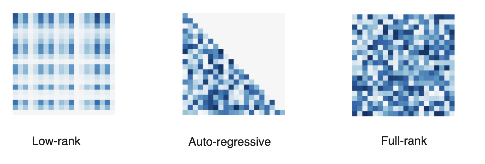

Caption: Jacobian structure of different normalising flows.

Figure 4: Jacobian structure of different normalising flows.

We can also compose such flows to get a new flow:

\[\begin{equation*}
\phi = \phi_K \circ \ldots \circ \phi_2 \circ \phi_1.
\end{equation*}\]

This can be a useful way to construct move expressive flows! The model’s log-likelihood is then given by summing each flow’s contribution

\[\begin{equation*}
\log q(y) = \log p(\phi^{-1}(y)) + \sum_{k=1}^K \log \det\left[\frac{\partial \phi_k^{-1}}{\partial x_{k+1}}(x_{k+1})\right]
\end{equation*}\]

with $x_k = \phi_K^{-1} \circ \ldots \circ \phi^{-1}_{k} (y)$.

### Continuous time limit

As mentioned previously, residual flows are transformations of the form $\phi(x) = x + \delta \ u(x)$ for some $\delta > 0$ and Lipschitz residual connection $u$. We can re-arrange this to get

\[\begin{equation*}
\frac{\phi(x) - x}{\delta} = u(x)
\end{equation*}\]

which is looking awfully similar to $u$ being a derivative. In fact, letting $\delta = 1/K$ and taking the limit $K \rightarrow \infty$ under certain conditions 4 , a composition of residual flows $\phi_K \circ \cdots \circ \phi_2 \circ \phi_1$ is given by an ordinary differential equation (ODE):

\[\begin{equation*}
\frac{\dd x_t}{\dd t} = \lim_{\delta \rightarrow 0} \frac{x_{t+\delta} - x_t}{\delta} = \frac{\phi_t(x_t) - x_t}{\delta} = u_t(x_t)
\end{equation*}\]

where the flow of the ODE $\phi_t: [0,1]\times\mathbb{R}^d\rightarrow\mathbb{R}^d$ is defined such that

\[\begin{equation*}
\frac{d\phi_t}{dt} = u_t(\phi_t(x_0)).
\end{equation*}\]

That is, $\phi_t$ maps initial condition $x_0$ to the ODE solution at time $t$:

\[\begin{equation*}
x_t \triangleq \phi_t(x_0) = x_0 + \int_{0}^t u_s(x_s) \dd{s} .
\end{equation*}\]

#### Continuous change-in-variables

Of course, this only defines the map $\phi_t(x)$; for this to be a useful normalising flow, we still need to compute the log-abs-determinant of the Jacobian!

As it turns out, the density induced by $\phi_t$ (or equivalently $u_t$) can be computed via the following equation 5

\[\begin{equation*}
\frac{\partial}{\partial_t} p_t(x_t) 
= - (\nabla \cdot (u_t p_t))(x_t).
\end{equation*}\]

This statement on the time-evolution of $p_t$ is generally known as the Transport Equation . We refer to $p_t$ as the probability path induced by $u_t$.

Computing the total derivative (as $x_t$ also depends on $t$) in log-space yields 6

\[\begin{equation*}
\frac{\dd}{\dd t} \log p_t(x_t) = - (\nabla \cdot u_t)(x_t)
\end{equation*}\]

resulting in the log density

\[\begin{equation*}
\log p_t(x) = \log p_0(x_0) - \int_0^t (\nabla \cdot u_s)(x_s) \dd{s}.
\end{equation*}\]

Parameterising a vector field neural network $u_\theta: \mathbb{R}_+ \times \mathbb{R^d} \rightarrow \mathbb{R^d}$ therefore induces a parametric log-density

\[\log p_\theta(x) \triangleq \log p_1(x) = \log p_0(x_0) - \int_0^1 (\nabla \cdot u_\theta)(x_t) \dd t.\]

In practice, to compute $\log p_t$ one can either solve both the time evolution of $x_t$ and its log density $\log p_t$ jointly

\[\begin{equation*}
\frac{\dd}{\dd t} \Biggl( \begin{aligned} x_t \ \quad \\ \log p_t(x_t) \end{aligned} \Biggr) = \Biggl( \begin{aligned} u_\theta(t, x_t) \quad \\ - \div u_\theta(t, x_t) \end{aligned} \Biggr),
\end{equation*}\]

or solve only for $x_t$ and then use quadrature methods to estimate $\log p_t(x_t)$.

Feeding this (joint) vector field to an adaptive step-size ODE solver allows us to control both the error in the sample $x_t$ and the error in the $\log p_t(x)$.

One may legitimately wonder why should we bother with such time-continuous flows versus discrete residual flows. There are a couple of benefits:

- CNFs can be seen as an automatic way of choosing the number of residual flows $K$ to use, which would otherwise be a hyperparameter we would have to tune. In the time-continuous setting, we can choose an error threshold $\epsilon$ and the adapative solver would give us a the discretisation step size $\delta$, effectively yielding $K = 1/\delta$ steps. Using an explicit first order solver, each step is of the form $x \leftarrow x + \delta \ u_\theta(t_k, x)$, akin to a residual flow, where the residual connection parameters $\theta$ are shared for each discretisation step, since $u_\theta$ is amortised over $t$, instead of having a different $\theta_k$ for each layer.

- In residual flows, during training we need to ensure that $u_\theta$ is $1 / \delta$ Lipschitz; otherwise the resulting flow will not be invertible and thus not a valid normalising flow. With CNFs, we still require the vector field $u_\theta(t, x)$ to be Lipschitz in $x$, but we don’t have to worry about exactly what this Lipschitz constant is, which is obviously much easier to satisfy and enforce in the neural architecture.

Now that you know why CNFs are cool, let’s have a look at what such a flow would be for a simple example.

Let’s come back to our earlier example of mapping a 1D Gaussian to another one with different mean. In contrast to previously where we derived a ‘one-shot’ (i.e. discrete ) flow bridging between the two Gaussians, we now aim to derive a time- continuous flow $\phi_t$ which would correspond to the time integrating a vector field $u_t$.

We have the following two distributions

\[\begin{equation*}
p_0 = \mathcal{N}(0, 1) \quad \text{and} \quad p_1 = \mathcal{N}(\mu, 1).
\end{equation*}\]

It’s not difficult to see that we can continuously bridge between these with a simple linear transformation

\[\begin{equation*}
\phi(t, x_0) = x_0 + \mu t
\end{equation*}\]

which is visualized in the figure below.

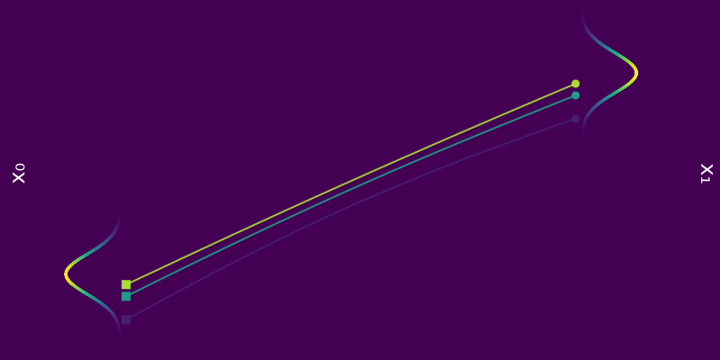

Caption: $\phi_t(x_0)$ for a few samples $x_0 \sim p_0 = \mathcal{N}(0, 1)$ coloured according to $p_0(x_0)$.

Figure 5: $\phi_t(x_0)$ for a few samples $x_0 \sim p_0 = \mathcal{N}(0, 1)$ coloured according to $p_0(x_0)$.

By linearity, we know that every marginal $p_t$ is a Gaussian, and so

\[\begin{equation*}
\mathbb{E}_{p_0}[\phi_t(x_0)] = \mu t
\end{equation*}\]

which, in particular, implies that $\mathbb{E}_{p_0}[\phi_1(x_0)] = \mu = \mathbb{E}_{p_1}[x_1]$. Similarly, we have

\[\begin{equation*}
\mathrm{Var}_{p_0}[\phi_t(x_0)] = 1 \quad \implies \quad \mathrm{Var}_{p_0}[\phi_1(x_0)] = 1 = \mathrm{Var}_{p_1}[x_1]
\end{equation*}\]

Hence we have a probability path $p_t = \mathcal{N}(\mu t, 1)$ bridging $p_0$ and $p_1$.

Caption: Probability path $p_t = \mathcal{N}(\mu t, 1)$ from $p_0 = \mathcal{N}(0, 1)$ to $p_1 = \mathcal{N}(\mu, 1)$.

Figure 6: Probability path $p_t = \mathcal{N}(\mu t, 1)$ from $p_0 = \mathcal{N}(0, 1)$ to $p_1 = \mathcal{N}(\mu, 1)$.

Now let’s determine what the vector field $u_t(x)$ would be in this case. As mentioned earlier, $u(t, x)$ should satisfy the following

\[\begin{equation*}
\dv{\phi_t}{t}(x_0) = u_t \big( \phi_t(x_0) \big).
\end{equation*}\]

Since we have already specified $\phi$, we can plug it in on the left hand side to get

\[\begin{equation*}
\dv{\phi_t}{t}(x_0) = \dv{t} \big( x_0 + \mu t \big) = \mu
\end{equation*}\]

which gives us

\[\begin{equation*}
\mu = u_t \big( x_0 + \mu t \big).
\end{equation*}\]

The above needs to hold for all $t \in [0, 1]$, and so it’s not too difficult to see that one such solution is the constant vector field

\[\begin{equation*}
u_t(x) = \mu.
\end{equation*}\]

We could of course have gone the other way, i.e. define the $u_t$ such that $p_0 \overset{u_t}{\longleftrightarrow} p_1$ and derive the corresponding $\phi_t$ by solving the ODE.

#### Training CNFs

Similarly to any flows, CNFs can be trained by maximum log-likelihood

\[\mathcal{L}(\theta) = \mathbb{E}_{x\sim q_1} [\log p_1(x)],\]

where the expectation is taken over the data distribution and $p_1$ is the parameteric distribution. This involves integrating the time-evolution of samples $x_t$ and log-likelihood $\log p_t$, both terms being a function of the parametric vector field $u_{\theta}(t, x)$. This requires

- ⚠️ Expensive numerical ODE simulations at training time!

- ⚠️ Estimators for the divergence to scale nicely with high dimension. 7

CNFs are very expressive as they parametrise a large class of flows, and therefore of probability distributions. Yet training can be extremely slow due to the ODE integration at each iteration. One may wonder whether a ‘simulation-free’, i.e. not requiring any integration, training procedure exists for training these CNFs.

## Flow matching

And that is exactly where Flow Matching (FM) comes in!

Flow matching is a simulation-free way to train CNF models where we directly formulate a regression objective w.r.t. the parametric vector field $u_\theta$ of the form

\[\begin{equation*}
\mathcal{L}(\theta)_{} = \mathbb{E}_{t \sim \mathcal{U}[0, 1]} \mathbb{E}_{x \sim p_t}\left[\|
u_\theta(t, x) - u(t, x) \|^2 \right].
\end{equation*}\]

In the equation above, $u(t, x)$ would be a vector field inducing a probability path (or bridge) $p_t$ interpolating the reference $p_0$ to $p_1$, i.e.

\[\begin{equation*}
\log p_1(x) = \log p_0 - \int_0^1 (\nabla \cdot u_t)(x_t) \dd{t}.
\end{equation*}\]

In words: we’re just performing regression on $u_t(x)$ for all $t \in [0, 1]$.

Of course, this requires knowledge of a valid $u(t, x)$, and if we already have access to $u_t$, there’s no point in learning an approximation $u_{\theta}(t, x)$ in the first place! But as we will see in the next section, we can leverage this formulation to construct a useful target for $u_{\theta}(t, x)$ witout having to compute explicitly $u(t, x)$.

This is where Conditional Flow Matching (CFM) comes to the rescue.

We say a valid $u_t$ because there is no unique vector field $u_t$; there are indeed many valid choices for $u_t$ inducing maps $p_0 \overset{\phi}{\longleftrightarrow} p_1$ as illustrated in the figure below. As we will see in what follows, in practice we have to pick a particular target $u_t$, which has practical implications.

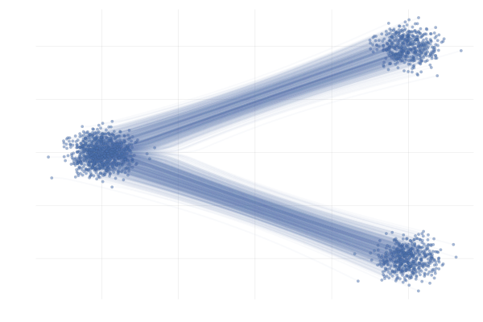

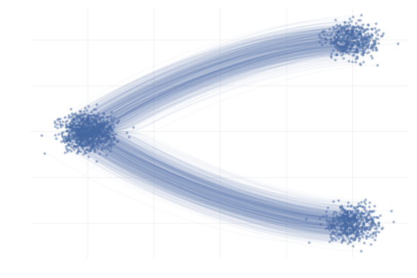

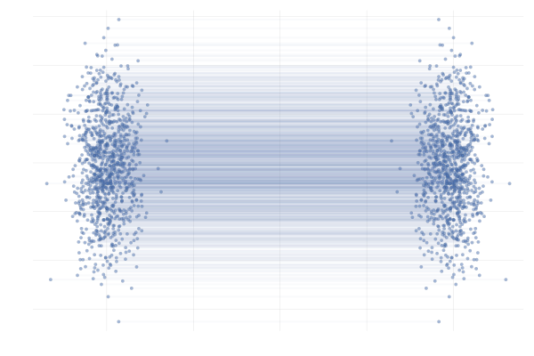

Figure 7: Different paths with the same endpoints marginals 8 .

### Conditional Flows

First, let’s remind ourselves that the transport equation relates a vector field $u_t$ to (the time evolution of) a probability path $p_t$

\[\begin{equation*}
\pdv{p_t(x)}{t} = - \nabla \cdot \big( u_t(x) p_t(x) \big),
\end{equation*}\]

thus constructing $p_t$ or $u_t$ is equivalent . One key idea (Lipman et al., 2023 and Albergo & Vanden-Eijnden, 2022) is to express the probability path as a marginal over a joint involving a latent variable $z$: $p_t(x_t) = \int p(z) ~p_{t\mid z}(x_t\mid z) \textrm{d}z$. The $p_{t\mid z}(x_t\mid z)$ term being a conditional probability path , satisfying some boundary conditions at $t=0$ and $t=1$ so that $p_t$ be a valid path interpolating between $q_0$ and $q_1$. In addition, as opposed to the marginal $p_t$ , the conditional $p_{t\mid1}$ could be available in closed-form.

In particular, as we have access to data samples $x_1 \sim q_1$, it sounds pretty reasonable to condition on $z=x_1$, leading to the following marginal probabilithy path

\[\begin{equation*}
p_t(x_t) = \int q_1(x_1) ~p_{t\mid 1}(x_t\mid x_1) \dd{x_1}.
\end{equation*}\]

In this setting, the conditional probability path $p_{t\mid 1}$ needs to satisfy the boundary conditions

\[\begin{equation*}
p_0(x \mid x_1) = p_0 \quad \text{and} \quad p_1(x \mid x_1) = \mathcal{N}(x; x_1, \sigmamin^2 I) \xrightarrow[\sigmamin \rightarrow 0]{} \delta_{x_1}(x)
\end{equation*}\]

with $\sigmamin > 0$ small, and for whatever reference $p_0$ we choose, typically something “simple” like $p_0(x) = \mathcal{N}(x; 0, I)$, as illustrated in the figure below.

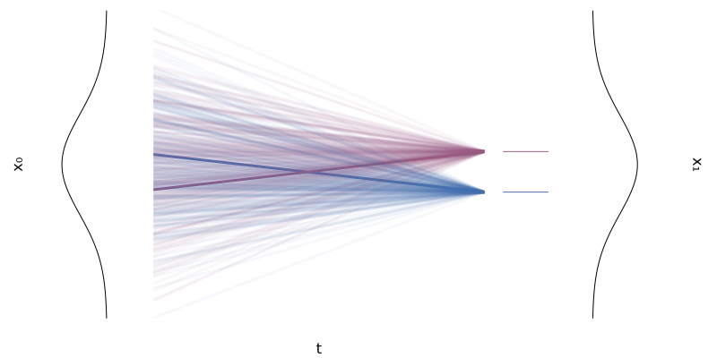

Caption: Two conditional flows $\phi_t(x \mid x_1)$ for two univariate Gaussians.

Figure 8: Two conditional flows $\phi_t(x \mid x_1)$ for two univariate Gaussians.

The conditional probability path also satisfies the transport equation with the conditional vector field $u_t(x \mid x_1)$:

\[\begin{equation}
\label{eq:continuity-cond}
\pdv{p_t(x \mid x_1)}{t} = - \nabla \cdot \big( u_t(x \mid x_1) p_t(x \mid x_1) \big).
\end{equation}\]

Lipman et al. (2023) introduced the notion of Conditional Flow Matching (CFM) by noticing that this conditional vector field $u_t(x \mid x_1)$ can express the marginal vector $u_t(x)$ of interest via the conditional probability path $p_{t\mid 1}(x_t\mid x_1)$ as

\[\begin{equation}
\label{eq:cf-from-cond-vf}
\begin{split}
  u_t(x) &= \mathbb{E}_{x_1 \sim p_{1 \mid t}} \left[ u_t(x \mid x_1) \right] \\
  &= \int u_t(x \mid x_1) \frac{p_t(x \mid x_1) q_1(x_1)}{p_t(x)} \dd{x}_1.
\end{split}
\end{equation}\]

To see why this $u_t$ the same the vector field as the one defined earlier, i.e. the one generating the (marginal) probability path $p_t$, we need to show that the expression above for the marginal vector field $u_t(x)$ satisfies the transport equation

\[\begin{equation*}
\pdv{\hlthree{p_t(x)}}{t} = - \nabla \cdot \big( \hltwo{u_t(x)} \hlthree{p_t(x)} \big).
\end{equation*}\]

Writing out the left-hand side, we have

\[\begin{equation*}
\begin{split}
  \pdv{\hlthree{p_t(x)}}{t} &= \pdv{t} \int p_t(x \mid x_1) q(x_1) \dd{x_1} \\
  &= \int \hlone{\pdv{t} \big( p_t(x \mid x_1) \big)} q(x_1) \dd{x_1} \\
  &= - \int \hlone{\nabla \cdot \big( u_t(x \mid x_1) p_t(x \mid x_1) \big)} q(x_1) \dd{x_1} \\
  &= - \int \hlfour{\nabla} \cdot \big( u_t(x \mid x_1) p_t(x \mid x_1) q(x_1) \big) \dd{x_1} \\
  &= - \hlfour{\nabla} \cdot \int u_t(x \mid x_1) p_t(x \mid x_1) q(x_1) \dd{x_1} \\
  &= - \nabla \cdot \bigg( \int u_t(x \mid x_1) \frac{p_t(x \mid x_1) q(x_1)}{\hlthree{p_t(x)}} {\hlthree{p_t(x)}} \dd{x_1} \bigg) \\
  &= - \nabla \cdot \bigg( {\hltwo{\int u_t(x \mid x_1) \frac{p_t(x \mid x_1) q(x_1)}{p_t(x)} \dd{x_1}}} \ {\hlthree{p_t(x)}} \bigg) \\
  &= - \nabla \cdot \big( \hltwo{u_t(x)} {\hlthree{p_t(x)}} \big)
\end{split}
\end{equation*}\]

where in the $\hlone{\text{first highlighted step}}$ we used \eqref{eq:continuity-cond} and in the $\hltwo{\text{last highlighted step}}$ we used the expression of $u_t(x)$ in \eqref{eq:cf-from-cond-vf}.

The relation between $\phi_t(x_0)$, $\phi_t(x_0 \mid x_1)$ and their induced densities are illustrated in the Figure 9 below. And since $\phi_t(x_0)$ and $\phi_t(x_0 \mid x_1)$ are solutions corresponding to the vector fields $u_t(x)$ and $u_t(x \mid x_1)$ with $x(0) = x_0$, Figure 9 is equivalent to Figure 10 , but note the difference in the expectation taken to go from $u_t(x_0 \mid x_1) \longrightarrow u_t(x_0)$ compared to $\phi_t(x_0 \mid x_1) \longrightarrow \phi_t(x_0)$.

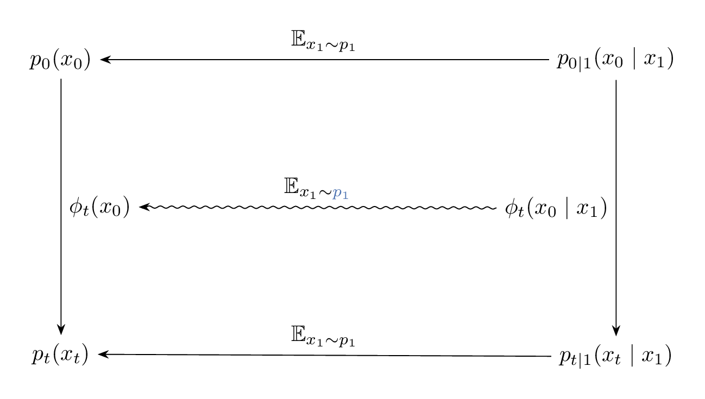

Caption: Diagram illustrating the relation between the paths $\phi_t(x_0)$, $\phi_t(x_0 \mid x_1)$, and their induced marginal and conditional densities.

Figure 9: Diagram illustrating the relation between the paths $\phi_t(x_0)$, $\phi_t(x_0 \mid x_1)$, and their induced marginal and conditional densities.

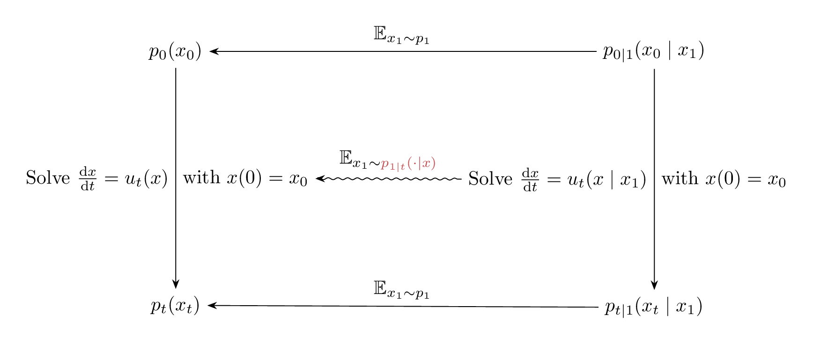

Caption: Diagram illustrating the relation between the vector fields $u_t(x_0)$, $u_t(x_0 \mid x_1)$, and their induced marginal and conditional densities.

Figure 10: Diagram illustrating the relation between the vector fields $u_t(x_0)$, $u_t(x_0 \mid x_1)$, and their induced marginal and conditional densities.

Let’s try to gain some intuition behind \eqref{eq:cf-from-cond-vf} and the relation between $u_t(x)$ and $u_t(x \mid x_1)$. We do so by looking at the following scenario

\[\begin{equation}
\tag{G-to-G}
\label{eq:g2g}
\begin{split}
p_0 = \mathcal{N}([-\mu, 0], I) \quad & \text{and} \quad p_1 = \mathcal{N}([+\mu, 0], I) \\
\text{with} \quad \phi_t(x_0 \mid x_1) &= (1 - t) x_0 + t x_1
\end{split}
\end{equation}\]

with $\mu = 10$ unless otherwise specified. We’re effectively transforming a Gaussian to another Gaussian using a simple time-linear map, as illustrated in the following figure.

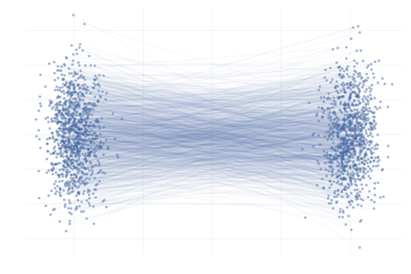

Caption: Example conditional paths $\phi_t(x_0 \mid x_1)$ of \eqref{eq:g2g} with $\mu = 10$.

Figure 11: Example conditional paths $\phi_t(x_0 \mid x_1)$ of \eqref{eq:g2g} with $\mu = 10$.

In the end, we’re really just interested in learning the marginal paths $\phi_t(x_0)$ for initial points $x_0$ that are probable under $p_0$, which we can then use to generate samples $x_1 = \phi_1(x_0)$. In this simple example, we can obain closed-form expressions for $\phi_t(x_0)$ corresponding to the conditional paths $\phi_t(x_0 \mid x_1)$ of \eqref{eq:g2g}, as visualised below.

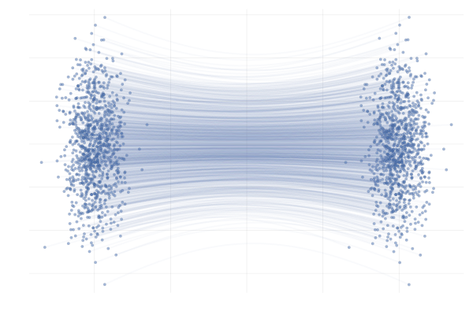

Caption: Example marginal paths $\phi_t(x_0)$ of \eqref{eq:g2g} with $\mu = 10$.

Figure 12: Example marginal paths $\phi_t(x_0)$ of \eqref{eq:g2g} with $\mu = 10$.

With that in mind, let’s pick a random initial point $x_0$ from $p_0$, and then compare a MC estimator for $u_t(x_0)$ at different values of $t$ along the path $\phi_t(x_0)$, i.e. we’ll be looking at

\[\begin{equation*}
\begin{split}
u_t \big( \phi_t(x_0) \big) 
&= \E_{p_{1 \mid t}}\left[u_t \big( \phi_t(x_0) \mid x_1 \big)\right] \\
&\approx \frac{1}{n} \sum_{i = 1}^n u_t \big( \phi_t(x_0) \mid x_1^{(i)} \big) \ \text{with } x_1^{(i)} \sim p_{1 \mid t}(x_1 \mid \phi_t(x_0)).
\end{split}
\end{equation*}\]

In practice we don’t have access to the posterior \(p_{1 \mid t}(x_1 \mid x_t)\), but in this specific setting we do have closed-form expressions for everything (Albergo & Vanden-Eijnden, 2022), and so we can visualise the marginal vector field \(u_t\big( \phi_t(x_0)\big)\) and the conditional vector fields \(u_t \big( \phi_t(x_0) \mid x_1^{(i)} \big)\) for all our “data” samples \(x_1^{(i)}\) and see how they compare. This is shown in the figure below.

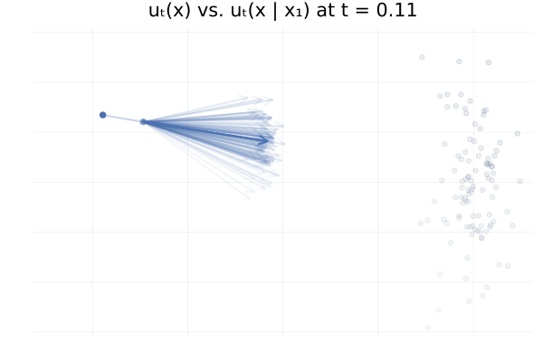

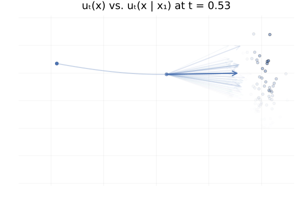

Figure 13: Marginal vector field $u_t(x)$ vs. conditional vector field $u_t(x \mid x_1)$ for samples $x_1 \sim p_1$. Here $p_0 = p_1 = \mathcal{N}(0, 1)$ and the two trajectories are according to the marginal vector field $u_t(x)$. Samples $x_1$ transparency is given by the IS weight $p_t(x \mid x_1) / p_t(x)$.

From the above figures, we can immediately see how for small $t$, i.e. near 0, the posterior $p_{1 \mid t}(x_1 \mid x_t)$ is quite scattered so the marginalisation giving $u_t$ involves many equally likely data samples $x_1$. In contrast, when $t$ increases and get closer to 1, $p_{1 \mid t}(x_1 \mid x_t)$ gets quite concentrated over much fewer samples $x_1$.

Moreover, equipped with the knowledge of \eqref{eq:cf-from-cond-vf}, we can replace

\[\begin{align}
\mathcal{L}_{\mathrm{FM}}(\theta) = \mathbb{E}_{t \sim \mathcal{U}[0, 1], x \sim p_t}\left[\|
u_\theta(t, x) - u(t, x) \|^2 \right],
\end{align}\]

where $u_t(x) = \mathbb{E}_{x_1 \sim p_{1 \mid t}} \left[ u_t(x \mid x_1) \right]$, with an equivalent loss regressing the conditional vector field $u_t(x \mid x_1)$ and marginalising $x_1$ instead:

\[\begin{equation*}
\mathcal{L}_{\mathrm{CFM}}(\theta) = \mathbb{E}_{t \sim \mathcal{U}[0, 1], x_1 \sim q, x_t \sim p_t(x \mid x_1)}\left[\|
u_\theta(t, x) - u_t(x \mid x_1) \|^2 \right].
\end{equation*}\]

These losses are equivalent in the sense that

\[\begin{equation*}
\nabla_\theta \mathcal{L}_{\mathrm{FM}}(\theta) = \nabla_\theta \mathcal{L}_{\mathrm{CFM}}(\theta),
\end{equation*}\]

which implies that we can use \({\mathcal{L}}_{\text{CFM}}\) instead to train the parametric vector field $u_{\theta}$. We defer the full proof to the footnote 9 , but show the key idea below. By developing the squared norm in both losses, we can easily show that the squared terms are equal or independent of $\theta$. Let’s develop the inner product term for \({\mathcal{L}}_{\text{FM}}\) and show that it is equal to the inner product of \({\mathcal{L}}_{\text{CFM}}\):

\[\begin{align}
\mathbb{E}_{x \sim p_t} ~\langle u_\theta(t, x), \hltwo{u_t(x)} \rangle 
&= \int \langle u_\theta(t, x), \hltwo{\int} u_t(x \mid x_1) \hltwo{\frac{p_t(x \mid x_1)q(x_1)}{p_t(x)} dx_1} \rangle p_t(x) \mathrm{d} x \\
&= \int \langle u_\theta(t, x), \int u_t(x \mid x_1) p_t(x \mid x_1)q(x_1) dx_1 \rangle \dd{x} \\
&= \int \int \langle u_\theta(t, x), u_t(x \mid x_1) \rangle p_t(x \mid x_1)q(x_1) dx_1 \dd{x} \\
&= \mathbb{E}_{q_1(x_1) p(x \mid x_1)} ~\langle u_\theta(t, x), u_t(x \mid x_1) \rangle
\end{align}\]

where in the $\hltwo{\text{first highlighted step}}$ we used the expression of $u_t(x)$ in \eqref{eq:cf-from-cond-vf}.

The benefit of the CFM loss is that once we define the conditional probability path $p_t(x \mid x_1)$, we can construct an unbiased Monte Carlo estimator of the objective using samples $\big( x_1^{(i)} \big)_{i = 1}^n$ from the data target $q_1$!

This estimator can be efficiently computed as it involves an expectation over the joint $q_1(x_1)p_t(x \mid x_1)$ , of the conditional vector field $u_t (x \mid x_1)$ both being available as opposed to the marginal vector field $u_t$ which involves an expectation over the posterior $p_{1 \mid t}(x_1 \mid x)$.

We note that, as opposed to the log-likelihood maximisation loss of CNFs which does not put any preference over which vector field $u_t$ can be learned, the CFM loss does specify one via the choice of a conditional vector field, which will be regressed by the neural vector field $u_\theta$.

### Gaussian probability paths

Let’s now look at practical example of conditional vector field and the corresponding probability path. Suppose we want conditional vector field which generates a path of Gaussians, i.e.

\[\begin{equation*}
p_t(x \mid x_1) = \mathcal{N}(x; \mu_t(x_1), \sigma_t(x_1)^2 \mathrm{I})
\end{equation*}\]

for some mean $\mu_t(x_1)$ and standard deviation $\sigma_t(x_1)$.

One conditional vector field inducing the above-defined conditional probability path is given by the following expression:

\[\begin{equation}
\label{eq:gaussian-path}
u_t(x \mid x_1) = \frac{\dot{\sigma_t}(x_1)}{\sigma_t(x_1)} (x - \mu_t(x_1)) + \dot{\mu_t}(x_1)
\end{equation}\]

as shown in the proof below.

$$
\begin{equation*}
\phi_t(x \mid x_1) = \mu_t(x_1) + \sigma_t(x_1) x
\end{equation*}
$$

and we want to determine $u_t(x \mid x_1)$ such that

$$
\begin{equation*}
\frac{\dd}{\dd t} \phi_t(x) = u_t \big( \phi_t(x) \mid x_1 \big)
\end{equation*}
$$

$$
\begin{equation*}
\begin{split}
\frac{\dd{}}{\dd{} t} \phi_t(x) &= \frac{\dd{}}{\dd{} t} \bigg( \mu_t(x_1) + \sigma_t(x_1) x \bigg) \\
&= \dot{\mu_t}(x_1) + \dot{\sigma_t}(x_1) x
\end{split}
\end{equation*}
$$

$$
\begin{equation*}
\dot{\mu_t}(x_1) + \dot{\sigma_t}(x_1) x = u_1 \big( \phi_t(x \mid x_1) \mid x_1 \big)
\end{equation*}
$$

$$
\begin{equation*}
u_1\big( \phi_t(x) \mid x_1\big) = h\big(t, \phi_t(x), x_1\big) \dot{\mu_t}(x_1) + g\big(t, \phi_t(x), x_1\big) \dot{\sigma_t}(x_1)
\end{equation*}
$$

for some functions $h$ and $g$. Reading of the components from the previous equation, we then see that we require

$$
\begin{equation*}
h\big(t, \phi_t(x), x_1\big) = 1 \quad \text{and} \quad
g(t, \phi_t(x), x_1) = x
\end{equation*}
$$

The simplest solution to the above is then just

$$
\begin{equation*}
h(t, x, x_1) = 1
\end{equation*}
$$

$$
\begin{equation*}
g(t, x, x_1) = \phi_t^{-1}(x) = \frac{x - \mu_t(x_1)}{\sigma_t(x_1)}
\end{equation*}
$$

$$
\begin{equation*}
g\big(t, \phi_t(x), x_1) = \phi_t^{-1} \big( \phi_t(x) \big) = x
\end{equation*}
$$

$$
\begin{equation*}
u_t \big( x \mid x_1 \big) = \dot{\mu_t}(x_1) + \dot{\sigma_t}(x_1) \bigg( \frac{x - \mu_t(x_1)}{\sigma_t(x_1)} \bigg)
\end{equation*}
$$

A simple choice for the mean $\mu_t(x_1)$ and std. $\sigma_t(x_1)$ is the linear interpolation for both, i.e.

\[\begin{align*}
\hlone{\mu_t(x_1)} &\triangleq t x_1 \quad &\text{and} \quad \hlthree{\sigma_t(x_1)} &\triangleq (1 - t) + t \sigmamin \\
\hltwo{\dot{\mu}_t(x_1)} &\triangleq x_1 \quad &\text{and} \quad \hlfour{\dot{\sigma}_t(x_1)} &\triangleq -1 + \sigmamin
\end{align*}\]

so that

\[\begin{equation*}
\big( {\hlone{\mu_0(x_1)}} + {\hlthree{\sigma_0(x_1)}} x_1 \big) \sim p_0 \quad \text{and} \quad \big( {\hlone{\mu_1(x_1)}} + {\hlthree{\sigma_1(x_1)}} x_1 \big) \sim \mathcal{N}(x_1, \sigmamin^2 I)
\end{equation*}\]

In addition, letting $p_0 = \mathcal{N}([-\mu, 0], I)$ and $p_1 = \mathcal{N}([+\mu, 0], I)$ for some $\mu > 0$, we’re back to the \ref{eq:g2g} example from earlier.

We can then plug this choice of $\mu_t(x_1)$ and $\sigma_t(x_1)$ into \eqref{eq:gaussian-path} to obtain the conditional vector field, writing $\hlthree{\sigma_t(x_1)} = 1 - (1 - \sigmamin) t$ to make our lives simpler,

\[\begin{equation*}
\begin{split}
u_t(x \mid x_1) &= \frac{\hlfour{- (1 - \sigmamin)}}{\hlthree{1 - (1 - \sigmamin) t}} (x - \hlone{t x_1}) + \hltwo{x_1} \\
&= \frac{1}{(1 - t) + t \sigmamin} \bigg( - (1 - \sigmamin) (x - t x_1) + \big(1 - (1 - \sigmamin) t \big) x_1 \bigg) \\
&= \frac{1}{(1 - t) + t \sigmamin} \bigg( - (1 - \sigmamin) x + x_1 \bigg) \\
&= \frac{x_1 - (1 - \sigmamin) x}{1 - (1 - \sigmamin) t}.
\end{split}
\end{equation*}\]

Below you can see the difference between $\phi_t(x_0)$ (top figure) and $\phi_t(x_0 \mid x_1)$ (bottom figure) for pairs $(x_0, x_1)$ with $x_0 \sim p_0$ and $x_1 = \phi_t(x_0)$. The paths are coloured by the sign of the 2nd vector component of $x_0$ to more clearly highlight the difference between the marginal and conditional flows.

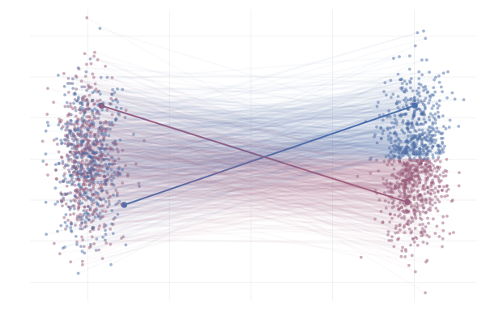

Caption: Realizations of paths from $p_0$ to $p_1$ following conditional vector fields $u_t(x \mid x_1)$. Paths are highlighted by the sign of the 2nd vector component at time $t=1$.

Figure 14: Realizations of paths from $p_0$ to $p_1$ following conditional vector fields $u_t(x \mid x_1)$. Paths are highlighted by the sign of the 2nd vector component at time $t=1$.

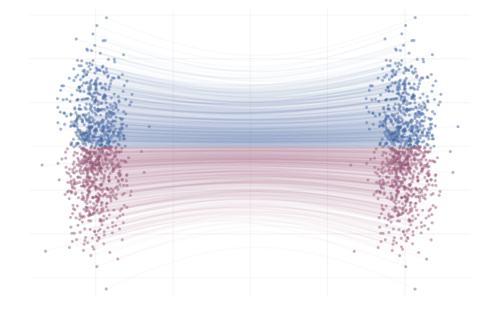

Caption: Paths from $p_0$ to $p_1$ following the true marginal vector field $u_t(x)$. Paths are highlighted by the sign of the 2nd vector component.

Figure 15: Paths from $p_0$ to $p_1$ following the true marginal vector field $u_t(x)$. Paths are highlighted by the sign of the 2nd vector component.

### But is CFM really all rainbows and unicorns?

Unfortunately not, no. There are two issues arising from crossing conditional paths . We will explain this just after, but now we stress that this leads to

- Non-straight marginal paths $\Rightarrow$ ODE hard to integrate $\Rightarrow$ slow sampling at inference.

- Many possible $x_1$ for a noised $x_t$ $\Rightarrow$ high CFM loss variance $\Rightarrow$ slow training convergence.

To get a better understanding of what these two points above, let’s revisit the \ref{eq:g2g} example once more. As we see in the figures below, realizations of the conditional vector field $u_t(x \mid x_1)$, i.e. sampling from the process

\[\begin{equation*}
\begin{split}
x_1 & \sim q \\
x_t & \triangleq \phi_t(x \mid x_1)
\end{split}
\end{equation*}\]

result in paths that are quite different from the marginal paths as illustrated in the figures below.

Caption: Realizations of conditional paths from $p_0 = p_1 = \mathcal{N}(0, 1)$ for two different $x_1^{(i)}, x_1^{(2)} \sim q$ with conditional vector field given by $u_t(x \mid x_1) = (1 - t) x + t x_1$.

Figure 16: Realizations of conditional paths from $p_0 = p_1 = \mathcal{N}(0, 1)$ for two different $x_1^{(i)}, x_1^{(2)} \sim q$ with conditional vector field given by $u_t(x \mid x_1) = (1 - t) x + t x_1$.

Caption: Paths from $p_0$ to $p_1$ following the true marginal vector field $u_t(x)$. Paths are highlighted by the sign of the 2nd vector component.

Figure 17: Paths from $p_0$ to $p_1$ following the true marginal vector field $u_t(x)$. Paths are highlighted by the sign of the 2nd vector component.

In particular, we can see that the marginal paths $\phi_t(x)$ do not cross ; this is indeed just the uniqueness property of ODE solutions. A realization of the conditional vector field $u_t(x \mid x_1)$ also exhibits the “non-crossing paths” property, similar to the marginal flows $\phi_t(x)$, however paths $\phi_t(x \mid x_1)$ corresponding to different realizations $x_1 \sim q_1$ may intersect, as highlighted in the figure above.

Consider two highlighted paths in the visualization of $u_t(x \mid x_1)$, with data samples $\hlone{x_1^{(1)}}$ and $\hlthree{x_1^{(2)}}$. When learning a parameterized vector field $u_{\theta}(t, x)$ via stochastic gradient descent (SGD), we approximate the CFM loss as:

\[\mathcal{L}_{\mathrm{CFM}}(\theta) \approx \frac{1}{2} \norm{u_{\theta}(t, \hlone{x_t^{(1)}}) - u(t, \hlone{x_t^{(1)}} \mid \hlone{x_1^{(1)}})} + \frac{1}{2} \norm{u_{\theta}(t, \hlthree{x_t^{(2)}}) - u(t, \hlthree{x_t^{(2)}} \mid \hlthree{x_1^{(2)}})}\]

where $t \sim \mathcal{U}[0, 1]$, $\hlone{x_1^{(1)}}, \hlthree{x_1^{(2)}} \sim q_1$, and $\hlone{x_t^{(1)}} \sim p_t(\cdot \mid \hlone{x_1^{(1)}}), \hlthree{x_t^{(2)}} \sim p_t(\cdot \mid \hlthree{x_1^{(2)}})$. We compute the gradient with respect to $\theta$ for a gradient step.

In such a scenario, we’re attempting to align $u_{\theta}(t, x)$ with two different vector fields whose corresponding paths are impossible under the marginal vector field $u(t, x)$ that we’re trying to learn! This fact can lead to increased variance in the gradient estimate, and thus slower convergence.

In slightly more complex scenarios, the situation becomes even more striking. Below we see a nice example from Liu et al. (2022) where our reference and target are two different mixture of Gaussians in 2D differing only by the sign of the mean in the x-component. Specifically,

\[\begin{equation}
\tag{MoG-to-MoG}
\label{eq:mog2mog}
\begin{split}
p_{\hlone{0}} &= (1 / 2)\mathcal{N}([{\hlone{-\mu}}, -\mu], I) + (1 / 2) \mathcal{N}([{\hlone{-\mu}}, +\mu], I) \\
\text{and} \quad p_{\hltwo{1}} &= (1 / 2) \mathcal{N}([{\hltwo{+\mu}}, -\mu], I) + (1 / 2) \mathcal{N}([{\hltwo{+\mu}}, +\mu], I) \\
\text{with} \quad \phi_t(x_0 \mid x_1) &= (1 - t) x_0 + t x_1
\end{split}
\end{equation}\]

where we set $\mu = 10$, unless otherwise specified.

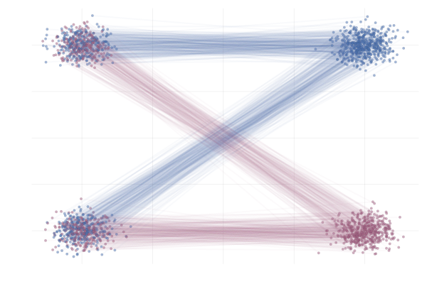

Caption: Realizations of conditional paths following conditional vector field $u_t(x \mid x_1)$ from \eqref{eq:mog2mog}. Paths are highlighted by the sign of the 2nd vector component.

Figure 18: Realizations of conditional paths following conditional vector field $u_t(x \mid x_1)$ from \eqref{eq:mog2mog}. Paths are highlighted by the sign of the 2nd vector component.

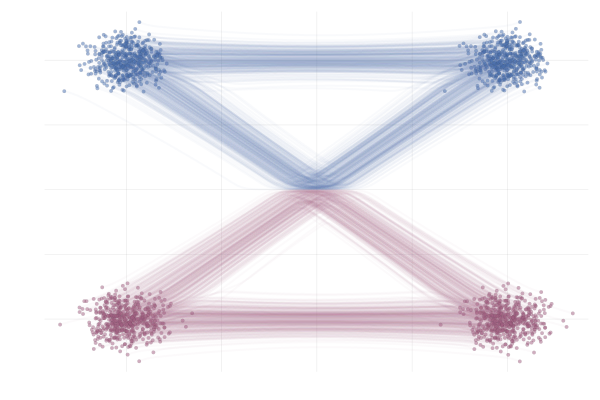

Caption: Realizations of marginal paths following the marginal vector field $u_t(x)$ from \eqref{eq:mog2mog}. Paths are highlighted by the sign of the 2nd vector component.

Figure 19: Realizations of marginal paths following the marginal vector field $u_t(x)$ from \eqref{eq:mog2mog}. Paths are highlighted by the sign of the 2nd vector component.

Here we see that marginal paths (bottom figure) end up looking very different from the conditional paths (top figure). Indeed, at training time paths may intersect, whilst at sampling time they cannot (due to the uniqueness of the ODE solution). As such we see on the bottom plot that some (marginal) paths are quite curved and would therefore require a greater number of discretisation steps from the ODE solver during inference.

We can also see how this leads to a significant variance of the CFM loss estimate for $t \approx 0.5$ in the figure below. More generally, samples from the reference distribution which are arbitrarily close to eachothers can be associated with either target modes, leading to high variance in the vector field regression loss.

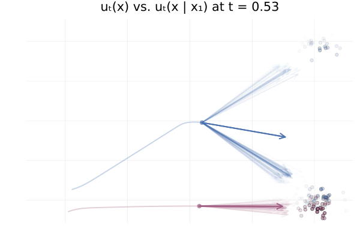

Caption: Realizations of conditional paths $\phi_t(x_0 \mid x_1)$ following the conditional vector field $u_t(x \mid x_1)$ for \eqref{eq:mog2mog}.

Figure 20: Realizations of conditional paths $\phi_t(x_0 \mid x_1)$ following the conditional vector field $u_t(x \mid x_1)$ for \eqref{eq:mog2mog}.

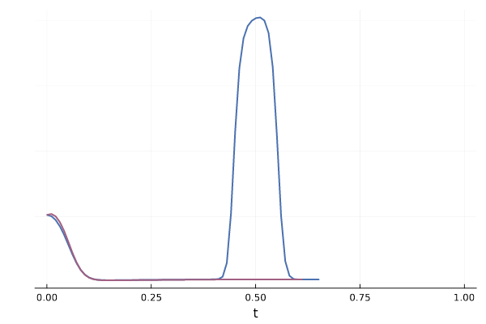

Caption: Variance of conditional vector field over $p_{1 \mid t}$ for both blue and red trajectories for \eqref{eq:mog2mog}.

Figure 21: Variance of conditional vector field over $p_{1 \mid t}$ for both blue and red trajectories for \eqref{eq:mog2mog}.

An intuitive solution would be to associate data samples with reference samples which are close instead of some arbitrary pairing. We’ll detail this idea next via the concept of couplings and optimal transport.

### Coupling

So far we have constructed the vector field $u_t$ by conditioning and marginalising over data points $x_1$. This is referred to as a one-sided conditioning , where the probability path is constructed by marginalising over $z=x_1$:

\[p_t(x_t) = \int p_t(x_t \mid z) q(z) \dd{z} = \int p_t(x_t \mid x_1) q(x_1) \dd{x_1}\]

e.g. \(p(x_t \mid x_1) = \mathcal{N}(x_t \mid x_1, (1-t)^2)\).

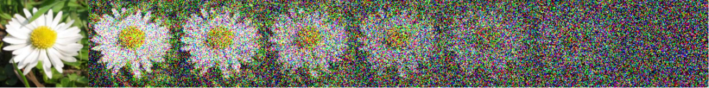

Caption: One sided interpolation. Source: Figure (2) in Albergo & Vanden-Eijnden (2022).

Figure 22: One sided interpolation. Source: Figure (2) in Albergo & Vanden-Eijnden (2022).

Yet, more generally, we can consider conditioning and marginalising over latent variables $z$, and minimising the following loss:

\[\mathcal{L}_{\mathrm{CFM}}(\theta) = \mathbb{E}_{(t,z,x_t) \sim \mathcal{U}[0,1] q(z) p(\cdot \mid z)}[\| u_\theta(t, x_t) - u_t(x_t \mid z)\|^2].\]

As suggested in Liu et al. (2023), Tong et al. (2023), Albergo & Vanden-Eijnden (2022) and Pooladian et al. (2023) one can condition on both endpoints $z=(x_1, x_0)$ of the process, referred as two-sided conditioning . The marginal probability path is defined as:

\[p_t(x_t) = \int p_t(x_t \mid z) q(z) \dd{z} = \int p_t(x_t \mid x_1, x_0) q(x_1, x_0) \dd{x_1} \dd{x_0}.\]

The following boundary condition on $p_t(x_t \mid x_1, x_0)$: $p_0(\cdot \mid x_1, x_0)=\delta_{x_0}$ and $p_1(\cdot \mid x_1, x_0) = \delta_{x_1}$ is required so that the marginal has the proper conditions $p_0 = q_0$ and $p_1 = q_1$.

For instance, a deterministic linear interpolation gives $p(x_t \mid x_0, x_1) = \delta_{(1-t)} x_0 + t x_1(x_t)$ and the simplest choice regarding the coupling $z = (x_1, x_0)$ is to consider independent samples: $q(x_1, x_0) = q_1(x_1) q_0(x_0)$.

Caption: Two sided interpolation. Source: Figure (2) in Albergo & Vanden-Eijnden (2022).

Figure 23: Two sided interpolation. Source: Figure (2) in Albergo & Vanden-Eijnden (2022).

One main advantage is that this allows for non Gaussian reference distribution $q_0$. Choosing a standard normal as noise distribution $q(x_0) = \mathcal{N}(0, \mathrm{I})$ we recover the same one-sided conditional probability path as earlier:

\[p(x_t \mid x_1) = \int p(x_t \mid x_0, x_1) q(x_0) \dd{x_0} = \mathcal{N}(x_t \mid tx_1, (1-t)^2).\]

#### Optimal Transport (OT) coupling

Now let’s go back to the idea of not using an independent coupling (i.e. pairing) but instead to correlate pairs $(x_1, x_0)$ with a joint $q(x_1, x_0) \neq q_1(x_1) q_0(x_0)$. Tong et al. (2023) and Pooladian et al. (2023) suggest using the optimal transport coupling

\[\begin{equation}
\tag{OT}
\label{eq:ot}
q(x_1, x_0) = \pi(x_1, x_0) \in \arg\inf_{\pi \in \Pi} \int \|x_1 - x_0\|_2^2 \mathrm{d} \pi(x_1, x_0)
\end{equation}\]

which minimises the optimal transport (i.e. Wasserstein) cost (Monge, 1781, Peyré and Cuturi 2020). The OT coupling $\pi$ associates samples $x_0$ and $x_1$ such that the total distance is minimised.

This OT coupling is illustrated in the right hand side of the figure below, adapted from Tong et al. (2023). In contrast to the middle figure which an independent coupling, the OT one does not have paths that cross. This leads to lower training variance and faster sampling 10 .

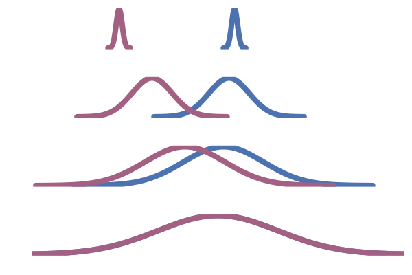

Caption: One-sided conditioning (Lipman et al., 2022)

Figure 24: One-sided conditioning (Lipman et al., 2022)

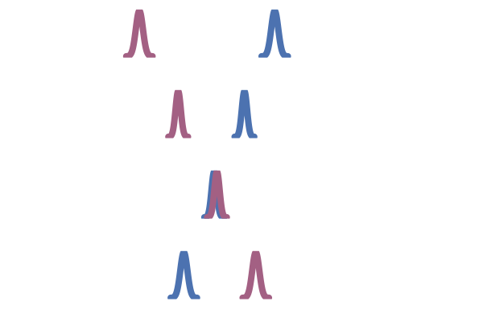

Caption: Two-sided conditioning (Tong et al., 2023)

Figure 25: Two-sided conditioning (Tong et al., 2023)

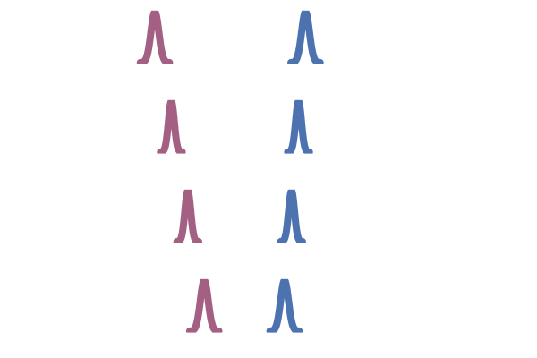

Caption: OT coupling (Tong et al., 2023)

Figure 26: OT coupling (Tong et al., 2023)

In practice, we cannot compute the optimal coupling $\pi$ between $x_1 \sim q_1$ and $x_0 \sim q_0$, as algorithms solving this problem are only known for finite distributions. In fact, finding a map from $q_0$ to $q_1$ is the generative modelling problem that we are trying to solve in the first place!

Tong et al. (2023) and Pooladian et al. (2023) propose to approximate the OT coupling $\pi$ by computing such optimal coupling only over each mini-batch of data and noise samples, coined mini-batch OT (Fatras et al., 2020). This is scalable as for finite collection of samples the OT problem can be computed with quadratic complexity via the Sinkhorn algorithm (Peyre and Cuturi, 2020). This results in a joint distribution $\gamma(i, j)$ over “inputs” \(\big(x_0^{(i)}\big)_{i=1,\dots,B}\) and “outputs” \(\big(x_1^{(j)}\big)_{j=1,\dots,B}\) such that the expected distance is (approximately) minimised. Finally, to construct a mini-batch from this $\gamma$ which we can subsequently use for training, we can either compute the expectation wrt. $\gamma(i, j)$ by considering all $n^2$ pairs (in practice, this can often boil down to only needing to consider $n$ disjoint pairs 11 ) or sample a new collection of training pairs $(x_0^{(i’)}, x_1^{(j’)})$ with $(i’, j’) \sim \gamma$ 12 .

For example, we can apply this to the \eqref{eq:g2g} example from before, which almost completely removes the crossing paths behaviour described earlier, as can be seen in the figure below.

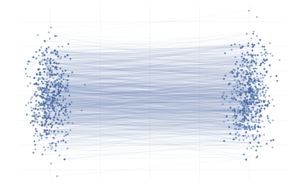

Figure 27: \eqref{eq:g2g} with uniformly sampled pairings (left) and with OT pairings (right).

We also observe similar behavior when applying this the more complex example \eqref{eq:mog2mog}, as can be seen in the figure below.

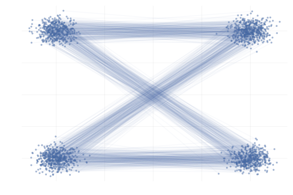

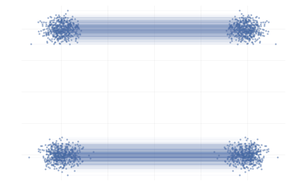

Figure 28: \eqref{eq:mog2mog} with uniformly sampled pairings (left) and with OT pairings (right).

All in all, making use of mini-batch OT seems to be a strict improvement over the uniform sampling approach to constructing the mini-batch in the above examples and has been shown to improve practical performance in a wide range of applications (Tong et al., 2023; Klein et al., 2023).

It’s worth noting that in \eqref{eq:ot} we only considered choosing the coupling $\gamma(i, j)$ such that we minimize the expected squared Euclidean distance. This works well in the examples \eqref{eq:g2g} and \eqref{eq:mog2mog}, but we could also replace squared Euclidean distance with some other distance metric when constructing the coupling $\gamma(i, j)$. For example, if we were modeling molecules using CNFs, it might also make sense to pick $(i, j)$ such that $x_0^{(i)}$ and $x_1^{(j)}$ are also rotationally aligned as is done in the work of Klein et al. (2023).

## Quick Summary

In short, we’ve shown that flow matching is an efficient approach to training continuous normalising flows (CNFs), by directly regressing over the vector field instead of explicitly training by maximum likelihood. This is enabled by constructing the target vector field as the marginalisation of simple conditional vector fields which (marginally) interpolate between the reference and data distribution, but crucially for which we can evaluate and integrate over time. A neural network parameterising the vector field can then be trained by regressing over these conditional vector fields. Similarly to CNFs, samples can be obtained at inference time by solving the ODE associated with the neural vector field.

In this post we have not talked about diffusion (i.e. score based) models on purpose as they are not necessary for understanding flow matching. Yet these are deeply related and even exactly the same in some settings. We are planning to explore these connections, along with generalisations in a follow-up post!

## Citation

Please cite us as:

@misc{mathieu2024flow, title = "An Introduction to Flow Matching", author = "Fjelde, Tor and Mathieu, Emile and Dutordoir, Vincent", journal = "https://mlg.eng.cam.ac.uk/blog/", year = "2024", month = "January", url = "https://mlg.eng.cam.ac.uk/blog/2024/01/20/flow-matching.html" }

## Acknowledgments

We deeply thank Michael Albergo, Valentin Debortoli and James Thornton for giving insightful feedback! And thank you to Andrew Foong for pointing out several typos and rendering issues!

## References

Albergo, Michael S. & Vanden-Eijnden, Eric (2023) Building Normalizing Flows with Stochastic Interpolants .

Behrmann, Jens and Grathwohl, Will and Chen, Ricky T. Q. and Duvenaud, David and Jacobsen, Joern-Henrik (2019). Invertible Residual Networks .

Betker, James, Gabriel Goh, Li Jing, TimBrooks, Jianfeng Wang, Linjie Li, LongOuyang, JuntangZhuang, JoyceLee, YufeiGuo, WesamManassra, PrafullaDhariwal, CaseyChu, YunxinJiao and Aditya Ramesh (2023). Improving Image Generation with Better Captions .

Chen & Gopinath (2000). Gaussianization .

Chen & Lipman (2023). Riemannian Flow Matching on General Geometries .

Chen, Ricky T. Q. and Behrmann, Jens and Duvenaud, David K and Jacobsen, Joern-Henrik (2019). Residual flows for invertible generative modeling .

De Bortoli, Mathieu & Hutchinson et al. (2022). Riemannian Score-Based Generative Modelling .

Dupont, Doucet & Teh (2019). Augmented Neural Odes .

Friedman (1987). Exploratory projection pursuit .

George Papamakarios, Theo Pavlakou, Iain Murray (2018). Masked Autoregressive Flow for Density Estimation .

Huang, Chin-Wei and Krueger, David and Lacoste, Alexandre and Courville, Aaron (2018). Neural Autoregressive Flows .

Klein, Krämer & Noé (2023). Equivariant Flow Matching .

Lipman, Yaron and Chen, Ricky T. Q. and Ben-Hamu, Heli and Nickel, Maximilian and Le, Matt (2022). Flow Matching for Generative Modeling .

Liu, Xingchao and Gong, Chengyue and Liu, Qiang (2022). Flow Straight and Fast: Learning to Generate and Transfer Data with Rectified Flow .

Monge, Gaspard (1781). Mémoire Sur La Théorie Des Déblais et Des Remblais.

Peyré, Gabriel and Cuturi, Marco (2020). Computational Optimal Transport .

Pooladian, Aram-Alexandre and {Ben-Hamu}, Heli and {Domingo-Enrich}, Carles and Amos, Brandon and Lipman, Yaron and Chen, Ricky T. Q. (2023). Multisample Flow Matching: Straightening Flows With Minibatch Couplings .

Song, Sohl-Dickstein & Kingma et al. (2020). Score-Based Generative Modeling Through Stochastic Differential Equations .

Tong, Alexander and Malkin, Nikolay and Fatras, Kilian and Atanackovic, Lazar and Zhang, Yanlei and Huguet, Guillaume and Wolf, Guy and Bengio, Yoshua (2023). Simulation-Free Schrodinger Bridges via Score and Flow Matching .

Tong, Malkin & Huguet et al. (2023). Improving and Generalizing Flow-Based Generative Models With Minibatch Optimal Transport .

Watson, Joseph L. and Juergens, David and Bennett, Nathaniel R. and Trippe, Brian L. and Yim, Jason and Eisenach, Helen E. and Ahern, Woody and Borst, Andrew J. and Ragotte, Robert J. and Milles, Lukas F. and Wicky, Basile I. M. and Hanikel, Nikita and Pellock, Samuel J. and Courbet, Alexis and Sheffler, William and Wang, Jue and Venkatesh, Preetham and Sappington, Isaac and Torres, Susana V{'a}zquez and Lauko, Anna and De Bortoli, Valentin and Mathieu, Emile and Ovchinnikov, Sergey and Barzilay, Regina and Jaakkola, Tommi S. and DiMaio, Frank and Baek, Minkyung and Baker, David (2023). De Novo Design of Protein Structure and Function with RFdiffusion .

The property $\phi \circ \phi^{-1} = \Id$ implies, by the chain rule, \(\begin{equation*} \pdv{\phi}{x} \bigg|_{x = \phi^{-1}(y)} \pdv{\phi^{-1}}{y} \bigg|_{y} = 0 \iff \pdv{\phi}{x} \bigg|_{x = \phi^{-1}(y)} = \bigg( \pdv{\phi^{-1}}{y} \bigg|_{y} \bigg)^{-1} \quad \forall y \in \mathbb{R}^d \end{equation*}\) ↩

Autoregressive (Papamakarios et al., 2018; Huang et al., 2018) One strategy is to factor the flow’s Jacobian to have a triangular structure by factorising the density as $p_\theta(x) = \prod_{d} p_\theta(x_d;x_{d<})$ with each conditional $p_\theta(x_d;x_{d<})$ being induced via a flow. Low rank residual (Van Den Berg et al., 2018) Another approach is to construct a flow via a residual connection: \(\begin{equation*} \phi(x) = x + A h(B x + b) \end{equation*}\) with parameters $A \in \R^{d\times m}$, $B \in \R^{ m\times m}$ and $b \in \R^m$. Leveraging Sylvester’s determinant identity $\det(I_d + AB)=\det(I_m + BA)$, the determinant computation can be reduced to one of a $m \times m$ matrix which is advantageous if $m \mathrm{«} d$. ↩

A sufficient condition for $\phi_k$ to be invertible is for $u_k$ to be $1/h$-Lipschitz [Behrmann et al., 2019]. The inverse $\phi_k^{-1}$ can be approximated via fixed-point iteration (Chen et al., 2019). ↩

A sufficient condition for $\phi_t$ to be invertible is for $u_t$ to be Lipschitz and continuous by Picard–Lindelöf theorem. ↩

The Fokker–Planck equation gives the time evolution of the density induced by a stochastic process. For ODEs where the diffusion term is zero, one recovers the transport equation. ↩

Expanding the divergence in the transport equation we have: \(\begin{equation*} \frac{\partial}{\partial_t} p_t(x_t) = - (\nabla \cdot (u_t p_t))(x_t) = - p_t(x_t) (\nabla \cdot u_t)(x_t) - \langle \nabla_{x_t} p_t(x_t), u_t(x_t) \rangle. \end{equation*}\) Yet since $x_t$ also depends on $t$, to get the total derivative we have \(\begin{align} \frac{\dd}{\dd t} p_t(x_t) &= \frac{\partial}{\partial_t} p_t(x_t) + \langle \nabla_{x_t} p_t(x_t), \frac{\dd}{\dd t} x_t \rangle \\ &= - p_t(x_t) (\nabla \cdot u_t)(x_t) - \langle \nabla_{x_t} p_t(x_t), u_t(x_t) \rangle + \langle \nabla_{x_t} p_t(x_t), \frac{\dd}{\dd t} x_t \rangle \\ &= - p_t(x_t) (\nabla \cdot u_t)(x_t). \end{align}\) Where the last step comes from $\frac{\dd}{\dd t} x_t = u_t$. Hence, $\frac{\dd}{\dd t} \log p_t(x_t) = \frac{1}{p_t(x_t)} \frac{\dd}{\dd t} p_t(x_t) = - (\nabla \cdot u_t)(x_t).$ ↩

The Skilling-Hutchinson trace estimator is given by $\Tr(A) = \E[v^\top A v]$ with $v \sim p$ isotropic and centred. In our setting we are interested in $\div(u_t)(x) = \Tr(\frac{\partial u_t(x)}{\partial x}) = \E[v^\top \frac{\partial u_t(x)}{\partial x} v]$ which can be approximated with a Monte-Carlo estimator, where the integrand is computed via automatic forward or backward differentiation. ↩

The top row is with reference $p_0 = \mathcal{N}([-a, 0], I)$ and target $p_1 = (1/2) \mathcal{N}([a, -10], I) + (1 / 2) \mathcal{N}([a, 10], I)$, and the bottom row is the \ref{eq:g2g} example. The left column shows the straight-line solutions for the marginals and the right column shows the marginal solutions induced by considering the straight-line conditional interpolants. ↩

Developing the square in both losses we get: \(\|u_\theta(t, x) - u_t(x \mid x_1)\|^2 = \|u_\theta(t, x)\|^2 + \|u_t(x \mid x_1)\|^2 - 2 \langle u_\theta(t, x), u_t(x \mid x_1) \rangle,\) and \(\|u_\theta(t, x) - u_t(x)\|^2 = \|u_\theta(t, x)\|^2 + \|u_t(x)\|^2 - 2 \langle u_\theta(t, x), u_t(x) \rangle.\) Taking the expectation over the last inner product term: \(\begin{align} \mathbb{E}_{x \sim p_t} ~\langle u_\theta(t, x), u_t(x) \rangle &= \int \langle u_\theta(t, x), \int u_t(x|x_1) \frac{p_t(x \mid x_1)q(x_1)}{p_t(x)} dx_1 \rangle p_t(x) \dd{x} \\ &= \int \langle u_\theta(t, x), \int u_t(x \mid x_1) p_t(x \mid x_1)q(x_1) dx_1 \rangle \dd{x} \\ &= \int \int \langle u_\theta(t, x), u_t(x \mid x_1) \rangle p_t(x \mid x_1)q(x_1) dx_1 \dd{x} \\ &= \mathbb{E}_{q_1(x_1) p(x \mid x_1)} ~\langle u_\theta(t, x), u_t(x \mid x_1) \rangle. \end{align}\) Then we see that the neural network squared norm terms are equal since: \(\mathbb{E}_{p_t} \|u_\theta(t, x)\|^2 = \int \|u_\theta(t, x)\|^2 p_t(x \mid x_1) q(x_1) \dd{x} \dd{x_1} = \mathbb{E}_{q_1(x_1) p(x \mid x_1)} \|u_\theta(t, x)\|^2\) ↩

Dynamic optimal transport [Benamou and Brenier, 2000] \(W(q_0, q_1)_2^2 = \inf_{p_t, u_t} \int \int_0^1 \|u_t(x)\|^2 p_t(x) \dd{t} \dd{x}\) ↩

In mini-batch OT, we only work with the empirical distributions over $x_0^{(i)}$ and $x_1^{(j)}$, i.e. they all have weights $1 / n$, where $n$ is the size of the mini-batch. This means that we can find a $\gamma$ matching the $\inf$ in \eqref{eq:ot} by solving what’s referred to as a linear assignment problem . This results in a sparse matrix with exactly $n$ entries, each then with a weight of $1 / n$. In such a scenario, computing the expectation over the joint $\gamma(i, j)$, which has $n^2$ entries but in this case only $n$ non-zero entries, can be done by only considering $n$ training pairs where every $i$ is involved in exactly one pair and similarly for every $j$. This is usally what’s done in practice. When solving the assignment problem is too computationally intensive, using Sinkhorn and a sampling from the coupling might be the preferable approach. ↩

Note the size of the resulting mini-batch sampled from $\gamma(i, j)$ does not necessarily have to be of the same size as the mini-batch size used to construct the mini-batch OT approximation as we can sample from $\gamma$ with replacement, but using the same size is typically done in practice, e.g. Tong et al. (2023). ↩
