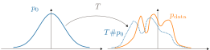
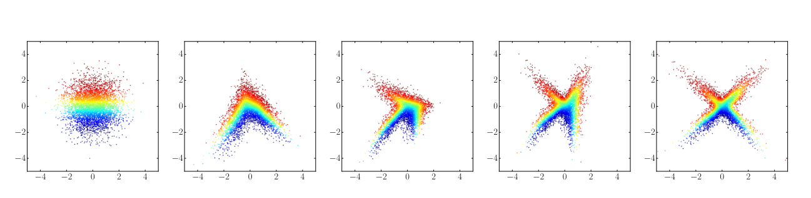
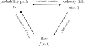
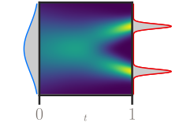
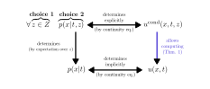

# A Visual Dive into Conditional Flow Matching | ICLR Blogposts 2025

Conditional flow matching (CFM) was introduced by three simultaneous papers at ICLR 2023, through different approaches (conditional matching, rectifying flows and stochastic interpolants). The main part of this post, Section 2, explains CFM by using both visual intuitions and insights on its probabilistic formulations. Section 1 introduces nomalizing flows; it can be skipped by reader familiar with the topic, or that wants to cover them later. Section 3 opens on the links between CFM and other approaches, and ends with a 'CFM playground'.

All authors contributed equally to this work.

The first part of the blog post is an introduction to generative modelling, normalizing flows and continuous normalizing flows. The reader already familiar with these topics, or that wants to cover them later, can directly jump to the second part , devoted to conditional flow matching .

## Introduction to Generative Modelling with Normalizing Flows

In a nutshell, the task of generative modelling consists in learning how to sample from a distribution \(p_{\mathrm{data}}\) given a finite number of samples \(x^{(1)}, \ldots, x^{(n)} \in \mathbb{R}^d\) drawn from \(p_{\mathrm{data}}\). It comes with three main challenges – the so-called “Generative learning trilemma” :

- enforce fast sampling

- generate high quality samples

- properly cover the diversity of \(p_{\mathrm{data}}\)

One may also add to this wishlist that the model should be easy to train.

The modern approach to generative modelling consists in picking a simple base distribution \(p_0\), typically an isotropic Gaussian \(\mathcal{N}(0, \mathrm{Id}_d)\), and learning a map \(T: \mathbb{R}^d \to \mathbb{R}^d\) such that when \(x\) follows \(p_0\) (i.e., \(x \sim p_0\)) , the distribution of \(T(x)\) is as close as possible to \(p_{\mathrm{data}}\) In all this post, by abuse of language we may use "distribution" when referring to densities; all densities are assumed strictly positive everywhere so that Kullback-Leibler divergences and logarithms are well defined. .

When \(x \sim p_0\), the distribution of \(T(x)\) is denoted as \(T\#p_0\), and called the pushforward of \(p_0\) by \(T\) The pushforward of the measure \(\mu\) by the map \(T\), \(T\#\mu\), is defined as \(T\#\mu(A) = \mu(T^{-1}(A))\) for all \(A\subset \mathbb{R}^d\). If the random variable \(x\) has law \(\mu\), the random variable \(T(x)\) has law \(T\#\mu\). . Once the map \(T\) is learned, one can simply sample \(x\) from \(p_0\) and use \(T(x)\) as a generated sample from \(p_\mathrm{data}\).

Two intertwined questions arise: what kind of map \(T\) to use, and how to learn it? A natural idea is to define \(T\) as a parametric map \(T_\theta\), typically a neural network, and to learn the optimal parameters \(\theta^*\) by maximizing the log-likelihood of the available samples Note there also exist generative methods based on other principles, e.g. GANs, that are not covered in this blogpost. :

\[\begin{equation}\label{eq:log_lik}
\theta^* = \mathop{\mathrm{argmax}}_\theta  \sum_{i=1}^n \log \left( (T_\theta \# p_0)(x^{(i)}) \right) \,.
\end{equation}\]

Approximately, maximizing the log-likelihood in \eqref{eq:log_lik} corresponds to making \(p_{\mathrm{data}}\) and \(T_\theta\#p_0\) close in the sense of the Kullback-Leibler divergence Indeed \(\begin{aligned} \mathop{\mathrm{KL}(p_{\mathrm{data}}, T_\theta\#p_0)} & \overset{\mathrm{def}}{=} \int_x \log \left(\frac{p_{\mathrm{data}}(x)}{T_\theta\#p_0(x)}\right) p_{\mathrm{data}}(x) \, \mathrm{d}x \\ & = \int_x \log (p_{\mathrm{data}}(x)) p_{\mathrm{data}}(x) \, \mathrm{d}x - \int_x \log (T_\theta\#p_0(x)) p_{\mathrm{data}}(x) \, \mathrm{d}x \ . \end{aligned}\) When minimizing with respect to \(\theta\) the first term of the right hand side is constant and can be ignored. The second term is simply \(-\mathbb{E}_{x \sim p_{\mathrm{data}}} [\log T_\theta\#p_0(x)]\): approximating it by an empirical mean using \(x^{(1)}, \ldots, x^{(n)}\) yields the objective in \eqref{eq:log_lik}. .

Caption: Modern generative modelling principle: trying to find a map \(T\) that sends the base distribution \(p_0\) as close as possible to the data distribution \(p_{\mathrm{data}}\).

### Normalizing Flows

In order to compute the log-likelihood objective function in \eqref{eq:log_lik}, if \(T_\theta\) is a diffeomorphism (and thus has a differentiable inverse \(T_\theta^{-1}\)), one can rely on the so-called change-of-variable formula

\[\begin{equation}\label{eq:change_variable}
\log p_1(x) = \log p_0(T_\theta^{-1}(x)) + \log |\det J_{T_\theta^{-1}}(x)|
\end{equation}\]

where \(J_{T_\theta^{-1}}\in \mathbb{R}^{d\times d}\) is the Jacobian of \(T^{-1}_{\theta}\). Relying on this formula to evaluate the likelihood imposes two constraints on the network:

- \(T_\theta\) must be invertible; in addition \(T_{\theta}^{-1}\) should be easy to compute in order to evaluate the first right-hand side term in \eqref{eq:change_variable}

- \(T_\theta^{-1}\) must be differentiable, and the (log) determinant of the Jacobian of \(T_\theta^{-1}\) must not be too costly to compute in order to evaluate the second right-hand side term in \eqref{eq:change_variable} Equivalently, both \(T^{-1}_\theta\) and the determinant of \(J_{T_\theta}\) must be easy to compute, since \(J_{T_\theta^{-1}}(x) = (J_{T_\theta}(T_\theta^{-1}(x)))^{-1}\) and \(\log|\det J_{T_\theta^{-1}}(x) | = - \log | \det J_{T_\theta}(T_\theta^{-1}(x))|\). .

The philosophy of Normalizing Flows (NFs) is to design special neural architectures satisfying these two requirements. Normalizing flows are maps \(T_\theta = \phi_K \circ \ldots \phi_1\), where each \(\phi_k\) is a simple transformation satisfying the two constraints – and hence so does \(T_\theta\). Let \(x_0 \sim p_0\) and \(x_{k} = \phi_k(x_{k-1})\) for \(k\in\{1, \ldots, K\}\), the chain rule yields the following formula for the log-likelihood

\[\begin{align*}
\log p_1(x_K) &= \log p_0(\phi_1^{-1} \circ \ldots \circ \phi_K^{-1} (x_K)) + \log |\det J_{\phi_1^{-1} \circ \ldots \circ \phi_K^{-1}}(x_K)| \\
&= \log p_0(\phi_1^{-1} \circ \ldots \circ \phi_K^{-1} (x_K)) + \sum_{k=1}^{K} \log | \det J_{\phi^{-1}_k}(x_{k}) |
\end{align*}\]

which is still easy to evaluate provided each \(\phi_k\) satisfies the two constraints.

Caption: Normalizing flow with \(K=4\), transforming an isotropic Gaussian (leftmost) to a cross shape target distribution (rightmost). Picture from

For example, one of the earliest instances of NF is the planar flow, which uses as building blocks

\[\phi_k(x) = x + \sigma(b_k^\top x + c) a_k\]

with \(a_k, b_k \in \mathbb{R}^d\), \(c \in \mathbb{R}\), and \(\sigma :\mathbb{R} \to \mathbb{R}\) a non linearity applied pointwise. The Jacobian of a planar flow block is \(J_{\phi_k}(x)= \mathrm{Id}_d + \sigma'(b_k^\top x + c) a_k b_k^\top\) whose determinant can be computed in \(\mathcal{O}(d)\) through the matrix determinant lemma \(\det (\mathrm{Id} + x y^\top) = 1 + x^\top y\). However, \(\phi_k^{-1}\) does not admit an analytical expression, and one must resort to iterative algorithms such as Newton's method to approximate it.

A more complex example of NF, that satisfies both constraints, is Real NVP .

\[\begin{equation}\label{eq:realnvp}
\begin{aligned}
\phi(x)_{1:d'} &= x_{1:d'}\\
\phi(x)_{d':d} &= x_{d':d} \odot \exp(s(x_{1:d'})) + t(x_{1:d'})
\end{aligned}
\end{equation}\]

where \(d' \leq d\) and the so-called scale \(s\) and translation \(t\) are functions from \(\mathbb{R}^{d'}\) to \(\mathbb{R}^{d-d'}\), parametrized by neural networks. This transformation is invertible in closed-form, and the determinant of its Jacobian is cheap to compute.

The Jacobian of \(\phi\) defined in \eqref{eq:realnvp} is lower triangular:

\[J_{\phi}(x) = \begin{pmatrix} \mathrm{Id}_{d'} & 0_{d',d -d'}  \\ ... & \mathrm{diag}(\exp(s(x_{1:d}))) \end{pmatrix}\]

hence its determinant can be computed at a low cost, and in particular without computing the Jacobians of \(s\) and \(t\). In addition, \(\phi\) is easily invertible:

\(\begin{align*} \phi^{-1}(y)_{1:d'} &= y_{1:d'} \\ \phi^{-1}(y)_{d':d} &= (y_{d':d} - t(y_{1:d'})) \odot \exp(- s(y_{1:d'})) \end{align*}\)

It has met with a huge success in practice and a variety of alternative NFs have been proposed . Unfortunately, the architectural constraints on Normalizing Flows tends to hinder their expressivity Alternative solutions exist, for example relying on invertible ResNets or the recently proposed free form normalizing flows , that are out of scope for this blog post. .

### Continuous Normalizing Flows

A successful solution to this expressivity problem is based on an idea similar to that of ResNets, named Continuous Normalizing Flows (CNF) . If we return to the planar normalizing flow, by letting \(u_{k-1}(\cdot) \overset{\mathrm{def}}{=} K\sigma(b_k^\top \cdot + c) a_k\), we can rewrite the relationship between \(x_{k}\) and \(x_{k-1}\) as:

\[\begin{align*}
x_k &= \phi_k(x_{k-1}) \\
    &= x_{k-1} + \sigma(b_k^\top x_{k-1} + c) a_k \\
    &= x_{k-1} + \frac{1}{K}  u_{k-1}(x_{k-1}) \\
\end{align*}\]

which can be interpreted as a forward Euler discretization, with step \(1/K\), of the ODE

\(\begin{equation}\label{eq:initial_value_pb} \begin{cases} x(0) = x_0 \\ \partial_t x(t) = u(x(t), t) \quad \forall t \in [0, 1] \end{cases} \end{equation}\) Note that the mapping defined by the ODE, \(T(x_0):= x(1)\) is inherently invertible because one can solve the reverse-time ODE (from \(t=1\) to \(0\)) with the initial condition \(x(1)=T(x_0)\).

This ODE is called an initial value problem , controlled by the velocity field \(u: \mathbb{R}^{d} \times [0, 1] \to \mathbb{R}^d\). In addition to \(u\), it is related to two other fundamental objects:

- the flow \(f^u: \mathbb{R}^d \times[0, 1] \to \mathbb{R}^d\), with \(f^u(x, t)\) defined as the solution at time \(t\) to the initial value problem driven by \(u\) with initial condition \(x(0) = x\).

- the probability path \((p_t)_{t\in[0,1]}\), defined by \(p_t = f^u(\cdot, t)\# p_0\), i.e., \(p_t\) is the distribution of \(f^u(x, t)\) when \(x \sim p_0\).

A fundamental equation linking \(p_t\) and \(u\) is the continuity equation , also called transport equation:

\[\begin{equation}\label{eq:continuity_eq}
  \partial_t p_t + \nabla\cdot u_t p_t = 0
\end{equation}\]

Under technical conditions and up to divergence-free vector fields, for a given \(p_t\) (resp. \(u\)) there exists a \(u\) (resp. \(p_t\)) such that the pair \((p_t, u)\) solves the continuity equation If \((p_t)_t\) is absolutely continuous and \(∣\partial_t p_t∣ \in L^1([0,1])∣\) then there exists a vector field \(u_t\) of finite length such that \((p_t, u)\) satisfies the continuity equation (see Theorem 8.3.1). For a field \(u\) regular enough such that the initial value problem has a unique solution on \([0,1]\), given \(p_0\), then \((p_t :=f^u(t,⋠)\#p_0, u)\) is a solution to the continuity equation (see Lemma 8.1.6). Note however that the correspondance between \(p_t\) and \(u\) is unique only up to divergence free fields. .

Caption: Link between the probability path, the velocity field and the flow.

Based on the ODE \eqref{eq:initial_value_pb}, Continuous Normalizing Flows work in the continuous-time domain, and directly model the continuous solution \((x(t))_{t \in [0, 1]}\) instead of a finite number of discretized steps \(x_1, \ldots, x_K\). They do so by learning the velocity field \(u\) as \(u_\theta: \mathbb{R}^d \times [0, 1] \to \mathbb{R}^d\). Sampling is then achieved by solving the initial value problem \eqref{eq:initial_value_pb} with \(x_0\) sampled from the base distribution \(p_0\).

<video src="assets/4a86a5a2_traj.mp4"></video>

CNFs are a particular case of Neural ODE networks Neural ODE functions are also defined as the solution of an initial value problem like \eqref{eq:initial_value_pb}, but the framework is more general: the loss \(\mathcal{L}\) used for training is arbitrary, and, in order to train \(u_\theta\), the authors provide a way to compute \(\nabla_\theta \mathcal{L}\) by solving an augmented, reversed ODE , with additional tricks to compute the likelihood in order to train them: if \(x(t)\) is the solution of the ODE \eqref{eq:initial_value_pb} with \(u = u_\theta\) , then its log-likelihood \(\log p_t(x(t))\) satisfies the so-called instantaneous change of variable formula , derived from the continuity equation:

\[\begin{equation}\label{eq:ce_logptxt}
\frac{\mathrm{d}}{\mathrm{d}t} \log p_t(x(t)) = - \mathrm{tr} J_{u_\theta(\cdot, t)} (x(t)) = - \nabla \cdot u_\theta(\cdot, t)(x(t)) \quad \forall t \in [0, 1]
\end{equation}\]

The proof relies on the identity

\[\nabla\cdot \left( p_t(x) u(t, x) \right) = \langle \nabla p_t(x) , u(x, t) \rangle + p_t(x) \nabla\cdot u(x, t) \, .\]

Starting from the continuity equation \eqref{eq:continuity_eq} at any \(t, x\) and dividing it by \(p_t(x)\), we get:

\[\begin{align}
    \frac{1}{p_t(x)} \frac{\mathrm{d} p_t}{\mathrm{d} t}(x) + \frac{1}{p_t(x)} \nabla\cdot(p_t(x) u(x, t)) &= 0 \nonumber \\
    \frac{\mathrm{d} \log p_t }{\mathrm{d} t} (x) + \frac{1}{p_t(x)} \langle \nabla p_t(x) , u(x, t) \rangle + \nabla\cdot u(x, t) &= 0 \label{eq:inst_change_pf}
  \end{align}\]

Note that if we plug \(x = x(t)\), the left-hand side is the derivative with respect to \(t\) of \(\log p_t\), evaluated at \(x(t)\). This is different from the derivative with respect to \(t\) of \(t \mapsto \log p_t(x(t))\) – the so-called total derivative , which we now compute:

\[\begin{align*}
    \frac{\mathrm{d} \log p_t(x(t))}{\mathrm{d}t} &=
    \frac{\mathrm{d} \log p_t }{\mathrm{d} t} (x(t)) + \langle \nabla \log p_t(x(t)), \frac{\mathrm{d}}{\mathrm{d}t} x(t) \rangle \\
       &=
    \frac{\mathrm{d} \log p_t }{\mathrm{d} t} (x(t)) + \langle \frac{1}{p_t(x_t)} \nabla p_t(x(t)), u_\theta(x(t), t) \rangle \\
        &= \frac{\mathrm{d} \log p_t }{\mathrm{d} t} (x(t)) + \langle \frac{1}{p_t(x_t)} \nabla p_t(x(t)), u_\theta(x(t), t) \rangle \\
        &= - \nabla\cdot u_\theta(x, t)
  \end{align*}\]

using \(\nabla \log p_t(x) = \frac{1}{p_t(x)} \nabla p_t(x)\) and \eqref{eq:inst_change_pf} successively. We conclude by observing that the divergence is equal to the trace of the Jacobian.

The ODE \eqref{eq:ce_logptxt} allows evaluating the log-likelihood objective in \eqref{eq:log_lik}, by finding the antecedent by the flow of the data point \(x^{(i)}\) as:

\[\begin{equation}\label{eq:inverting_cnf}
x(0) = x^{(i)} + \int_1^0 u_\theta(x(t), t) \mathrm{dt}
\end{equation}\]

(i.e., solving \eqref{eq:initial_value_pb} in reverse), and then Actually, both \(x(0)\) and \(\log p_1(x^{(i)})\) can be computed in one go, by introducing the unknown \(F(t) = \begin{pmatrix} x(t) \\ \log p_t(x(t)) - \log p_1(x(1)) \end{pmatrix}\) and solving the augmented ODE $$ \frac{\mathrm{d}}{\mathrm{d} t} F(t) = \begin{pmatrix} u_\theta(x(t), t) \\ - \nabla\cdot u_\theta(\cdot, t)(x(t)) \end{pmatrix} $$ with initial condition \(F(1) = \begin{pmatrix} x^{(i)} \\ 0 \end{pmatrix}\). Evaluating the solution \(F\) at \(t=0\) gives both \(x(0)\) and \(\log p_0(x(0)) - \log p_1(x^{(i)})\); since \(p_0\) is available in closed form, this yields \(\log p_1(x^{(i)})\). integrating \eqref{eq:ce_logptxt}:

\[\log p_1(x^{(i)}) = \log p_0(x(0)) - \int_0^1 \nabla \cdot u_\theta(\cdot, t)(x(t)) \mathrm{dt}\]

Finally, computing the gradient of the log-likelihood with respect to the parameters \(\theta\) in \(u_\theta\) is done by solving a reversed and augmented ODE, relying on the adjoint method as in the general Neural ODE framework .

The main benefits of continuous NF are:

- the constraints one needs to impose on \(u\) are much less stringent than in the discrete case: for the solution of the ODE to be unique, one only needs \(u\) to be Lipschitz continuous in \(x\) and continuous in \(t\)

- inverting the flow can be achieved by simply solving the ODE in reverse, starting from \(t=1\) with condition \(x(1) = x^{(i)}\) as in \eqref{eq:inverting_cnf}

- computing the likelihood does not require inverting the flow, nor to compute a log determinant; only the trace of the Jacobian is required, that can be approximated using the Hutchinson trick The Hutchinson trick is \(\mathop{\mathrm{tr}} A = \mathbb{E}_\varepsilon[\varepsilon^t A \varepsilon]\) for any random variable \(\varepsilon \in \mathbb{R}^d\) having centered, independent components of variance 1. In practice, the expectation is approximated by Monte-Carlo sampling, usually using only one realization of \(\varepsilon\) .

However, training a neural ODE with log-likelihood does not scale well to high-dimensional spaces, and the process tends to be unstable, likely due to numerical approximations and to the (infinite) number of possible probability paths. In contrast, the flow-matching framework, which we now describe, explicitly targets a specific probability path during training. It is a likelihood-free approach, that does not require solving ODE – being hence coined a simulation-free method.

## Conditional Flow Matching

This part presents Conditional Flow Matching (CFM). While the first part gives interesting background on normalizing flows, it is not a strict requirement to understand the principle of CFM.

Before giving the goal and intuition of CFM, we summarize the main concepts and visual representation used in this blog post.

Caption: Three types of visuals used in this blog post.

Core concepts and visuals manipulated in this post

Figure illustrates the key background elements necessary to understand Flow Matching.

- (left) A flow that maps a simple distribution \(p_0\) in blue (typically \(\mathcal{N}(0,1)\)) into the data distribution to be modelled \(\pdata\) in red. The probability path \(\p\) associates to each time \(t\), a distribution (dashed).

- (center) The two distributions (in gray) together with a probability path \(\p\) shown as a heatmap. Such a sufficiently regular probability path is governed by a velocity field \(\u\).

- (right) The velocity field \(\u\) (shown with arrows and colors) corresponding to the previous probability path. The animation shows samples from \(p_0\) that follow the velocity field. The distribution of these samples corresponds to \(\p\).

### Intuition of Conditional Flow Matching

Goal . Similarly to continuous normalizing flows, the goal of conditional flow matching is to find a velocity field \(\utheta\) that, when followed/integrated, transforms \(p_0\) into \(\pdata\). Once the velocity field is estimated, the data generation process of conditional flow matching and continuous normalizing flows are the same. It is illustrated in Figure . The particularity of CFM is how the velocity field is learned, as we will detail below.

Intuition . In order to make the learning of the velocity field \(\utheta\) easier, one would like to get a supervision signal at each time step \(t \in [0,1]\) (and not only at time \(t=1\)). However, as illustrated in Figure , there exists an infinite number of probability paths \(p_t\) (equivalently an infinite number of velocity fields \(\u\)) that tranform \(p_0\) in \(\pdata\). Thus, in order to get supervision for all \(t\), one must fully specify a probability path/velocity field .

Organization . In the Modelling Choices Section we provide details on how CFM fully specifies a probability path \(p_t\) that transforms \(p_0\) into \(\pdata\): this is not trivial since \(\pdata\) is unknown. Then in the From Conditional to Unconditional Velocity Section we provide new intuition on how to interpret the corresponding fully specified velocity field \(\u\). Finally, we recall how CFM learns the velocity field \(\u\) in a tractable fashion.

### Modelling Choices

We consider \(t\) as a random variable and interchangeably write \(p(x \| t)\) and \(p_t(x)\).

How to fully specify a probability path \(p_t\)? For unknown target data distribution \(\pdata\) it is hard to choose a priori a probability path or velocity field. CFM core idea is to choose a conditioning variable \(z\) and a conditional probability path \(\pcond\) (examples below) such that (1) the induced global probability path \(\p\) transforms \(p_0\) into \(\pdata\), (2) the associated velocity field \(u^\mathrm{cond}\) has an analytic form.

Example 1: Linear interpolation

A first choice is to condition on the base points and the target points, i.e., \(z\) is a random variable defined as:

\[\begin{align*}
z \overset{\mathrm{choice}}{=} (x_0, x_1) \sim p_0 \times p_\mathrm{data} \, .
\end{align*}\]

Among all the possible probability paths, one can choose to use very concentrated Gaussian distributions and simply interpolate between \(x_0\) and \(x_1\) in straight line: for some fixed standard deviation \(\sigma\), it writes as

\[\begin{align*}
p \big (x | t, z=(x_0, x_1) \big) \overset{\mathrm{choice}}{=} \mathcal{N}((1 - t) \cdot x_0 + t \cdot x_1, \sigma^2 \mathrm{Id}) \, .
\end{align*}\]

To recover the correct distributions \(p_0\) at \(t= 0\) (resp. \(p_\mathrm{target}\) at \(t=1\)), one must enforce \(\sigma = 0\), finally leading to

\[\begin{align*}
p \big (x | t, z=(x_0, x_1) \big) \overset{\mathrm{choice}}{=} \delta_{ (1-t) \cdot x_0 + t \cdot x_1 } (x) \, ,
\end{align*}\]

where \(\delta\) denotes the Dirac delta distribution.

\(t\) will always be a uniform random variable between \(0\) and \(1,\) hence \(p(t)=1\), and \(p(x \| t) = \frac{p(x, t)}{p(t)} = p(x, t)\). Similarly \(\pcond = p(x,t|z)\).

Caption: Conditional probability paths as linear interpolation. (left) \(p(x|t, z=z^{(i)})\) for six samples \(z^{(i)}\) (each being a pair \((x_0,x_1)\)). (right) Visualizing the convergence of the empirical average towards \(p(x|t) = \Ebracket{z}{p(x|t,z)} \approx \frac{1}{N} \sum_{i=1}^N p(x|t,z=z^{(i)})\).

<video src="assets/d5eb6b49_a_accumulate_pcond.mp4"></video>

Caption: Conditional probability paths as linear interpolation. (left) \(p(x|t, z=z^{(i)})\) for six samples \(z^{(i)}\) (each being a pair \((x_0,x_1)\)). (right) Visualizing the convergence of the empirical average towards \(p(x|t) = \Ebracket{z}{p(x|t,z)} \approx \frac{1}{N} \sum_{i=1}^N p(x|t,z=z^{(i)})\).

Then, one can show that setting

\[\ucondcustom{x,t,z = (x_0,x_1)} = x_1 - x_0\]

satisfies the continuity equation with \(\pcond\) In the sense of distributions, one has $$ \begin{align*} & \partial_t p_t (x | t, z) + \nabla \cdot (\ucond p (x|t,z)) \\ =& \langle x_1 - x_0 , \nabla \delta_{ (1-t) \cdot x_0 + t \cdot x_1 }(x) \rangle + \delta_{ (1-t) \cdot x_0 + t \cdot x_1 }(x) \nabla \cdot \ucond + \langle \ucond, \nabla \delta_{ (1-t) \cdot x_0 + t \cdot x_1 }(x) \rangle \end{align*} $$ One can easily identify that \(u(x,t,z) = x_1 - x_0\) which is constant with respect to \(x\) (hence, such that \(\nabla\cdot \ucond = 0 \)) is a suitable solution to the continuity equation. . Hence, the two choices made – \(z\) and \(p(x |t,z)\) – result in a very easy-to-compute conditional velocity field \(\ucondcustom{x,t,z = (x_0,x_1)}\) which will be later used as a supervision signal to learn \(u_\theta (x,t)\).

Example 2: Conical Gaussian paths

One can make other choices for the conditioning variable, for instance

\[\begin{align*}
z \overset{\mathrm{choice}}{=} x_1 \sim \pdata \, ,
\end{align*}\]

and the following choice for the conditional probability path: simply translate and progressively scale down the base normal distribution towards a Dirac delta in \(z\):

\[\begin{align*}
p(x | t, z=x_1)
\overset{\mathrm{choice}}{=} \mathcal{N}(tx_1, (1 - t)^2 \mathrm{Id}) \, .
\end{align*}\]

Caption: Conditional probability paths as shrinking conical Gaussians. (left) \(p(x|t, z=z^{(i)})\) for six samples \(z^{(i)}\) (each being a value \(x_1\)). (right) Visualizing the convergence of the empirical average towards \(p(x|t) = \Ebracket{z}{p(x|t,z)} \approx \frac{1}{N} \sum_{i=1}^N p(x|t,z=z^{(i)})\).

<video src="assets/375bcfe2_l_accumulate_pcond.mp4"></video>

Caption: Conditional probability paths as shrinking conical Gaussians. (left) \(p(x|t, z=z^{(i)})\) for six samples \(z^{(i)}\) (each being a value \(x_1\)). (right) Visualizing the convergence of the empirical average towards \(p(x|t) = \Ebracket{z}{p(x|t,z)} \approx \frac{1}{N} \sum_{i=1}^N p(x|t,z=z^{(i)})\).

Then, one can show that setting \(\ucondcustom{x,t,z = x_1} = \frac{x - x_1}{1 - t}\) leads to a couple \((\ucond, \pcond)\) satisfying the continuity equation.

General construction of conditional probability paths

To build a conditional probability path, the user must make two modelling choices:

- first, a conditioning variable \(z\) (independent of \(t\))

- then, conditional probability paths As Albergo and coauthors , one can construct the conditional probability path by first defining a conditional flow (also called stochastic interpolant) \(f_t^\mathrm{cond}(x, z)\). By pushing \(p_0\), these flows define random variables \(x \vert t, z = f^\mathrm{cond}(x, t, z)\), which have conditional distributions \(p(\cdot \vert z, t) = f^\mathrm{cond}(\cdot, t, z)\#p_0\). \(\pcond\) that must satisfy the following constraint: marginalizing \(p(x \vert z, t=0)\) (resp. \(p(x \vert z, t=1)\)) over \(z\), yields \(p_0\) (resp. \(\pdata\)). In other words, \(\pcond\) must satisfy

\[\begin{align*}
\forall x \enspace & \Ebracket{z}{ p(x \vert z, t=0) } = p_0(x) \enspace, \\
\forall x \enspace & \Ebracket{z}{ p(x \vert z, t=1) } = \pdata(x) \enspace.
\end{align*}\]

- Choice 1:

\[\begin{align*}
&z = (x_0, x_1) \sim p_0 \times p_\mathrm{target} \\
&\pcond = \delta_{(1 - t) x_0  + t x_1}(x)
\end{align*}\]

One also easily checks that \(\int_z p(x \vert z, t=0) p(z) \mathrm{d}z = \int_z \delta_{x_0}(x) p(z) \mathrm{d}z = p_0(x)\) and \(\int_z p(x \vert z, t=1) p(z) \mathrm{d}z = \int_z \delta_{x_1}(x) p(z) \mathrm{d}z = p_\mathrm{target}(x)\)

Note that the choice \(p \big (x | t, z=(x_0, x_1) \big) = \mathcal{N}((1 - t) \cdot x_0 + t \cdot x_1, \sigma^2)\), \(\sigma> 0\) does not (exactly) respect the constraint \(\Ebracket{z}{ p(x \vert z, t=0)} = p_0(x)\), but it has been sometimes used in the literature.

- Choice 2 (valid for a Gaussian \(p_0\) only):

\[\begin{align*}
&z = x_1 \sim p_\mathrm{target} \\
&\pcond = \mathcal{N}(t z, (1 - t)^2 \mathrm{Id})
\end{align*}\]

One easily checks that \(\int_z p(x \vert z, t=0) p(z) \mathrm{d}z = \int_z p_0(x) p(z) \mathrm{d}z = p_0(x)\) and \(\int_z p(x \vert z, t=1) p(z) \mathrm{d}z = \int_z \delta_z(x) p(z) \mathrm{d}z = p_\mathrm{target}(x)\), so those are admissible conditional paths.

### From Conditional to Unconditional Velocity

The previous section provided examples on how to choose a conditioning variable \(z\) and a simple conditional probability path \(\pcond\). The marginalization of \(\pcond\) directly yields a (intractable) closed-form formula for the probability path: \(\p = \Ebracket{z}{\pcond}\).

$$p(x,t|z=z^{(i)})$$

$$p(x,t)$$

![(top) Illustration of conditional probability paths. \(p(x, t | z^{(i)}) = \mathcal{N}((1 - t) \cdot x_0 + t \cdot x_1, \sigma^2)\). (bottom) Illustration of the associated conditional velocity fields \(\ucond = x_1 - x_0\) for three different values of \(z =(x_0, x_1)\). (top right) By marginalization over \(z\), the conditional probability paths directy yield an expression for the probability path. (bottom right) Expressing the velocity field \(\u\) as a function of the conditional velocity field \(\ucond\) is not trivial.](assets/3dbf426f_a_pcond_0.svg)

Caption: (top) Illustration of conditional probability paths. \(p(x, t | z^{(i)}) = \mathcal{N}((1 - t) \cdot x_0 + t \cdot x_1, \sigma^2)\). (bottom) Illustration of the associated conditional velocity fields \(\ucond = x_1 - x_0\) for three different values of \(z =(x_0, x_1)\). (top right) By marginalization over \(z\), the conditional probability paths directy yield an expression for the probability path. (bottom right) Expressing the velocity field \(\u\) as a function of the conditional velocity field \(\ucond\) is not trivial.

![(top) Illustration of conditional probability paths. \(p(x, t | z^{(i)}) = \mathcal{N}((1 - t) \cdot x_0 + t \cdot x_1, \sigma^2)\). (bottom) Illustration of the associated conditional velocity fields \(\ucond = x_1 - x_0\) for three different values of \(z =(x_0, x_1)\). (top right) By marginalization over \(z\), the conditional probability paths directy yield an expression for the probability path. (bottom right) Expressing the velocity field \(\u\) as a function of the conditional velocity field \(\ucond\) is not trivial.](assets/87c361dd_a_pcond_1.svg)

Caption: (top) Illustration of conditional probability paths. \(p(x, t | z^{(i)}) = \mathcal{N}((1 - t) \cdot x_0 + t \cdot x_1, \sigma^2)\). (bottom) Illustration of the associated conditional velocity fields \(\ucond = x_1 - x_0\) for three different values of \(z =(x_0, x_1)\). (top right) By marginalization over \(z\), the conditional probability paths directy yield an expression for the probability path. (bottom right) Expressing the velocity field \(\u\) as a function of the conditional velocity field \(\ucond\) is not trivial.

![(top) Illustration of conditional probability paths. \(p(x, t | z^{(i)}) = \mathcal{N}((1 - t) \cdot x_0 + t \cdot x_1, \sigma^2)\). (bottom) Illustration of the associated conditional velocity fields \(\ucond = x_1 - x_0\) for three different values of \(z =(x_0, x_1)\). (top right) By marginalization over \(z\), the conditional probability paths directy yield an expression for the probability path. (bottom right) Expressing the velocity field \(\u\) as a function of the conditional velocity field \(\ucond\) is not trivial.](assets/88f0bff7_a_pcond_2.svg)

Caption: (top) Illustration of conditional probability paths. \(p(x, t | z^{(i)}) = \mathcal{N}((1 - t) \cdot x_0 + t \cdot x_1, \sigma^2)\). (bottom) Illustration of the associated conditional velocity fields \(\ucond = x_1 - x_0\) for three different values of \(z =(x_0, x_1)\). (top right) By marginalization over \(z\), the conditional probability paths directy yield an expression for the probability path. (bottom right) Expressing the velocity field \(\u\) as a function of the conditional velocity field \(\ucond\) is not trivial.

![(top) Illustration of conditional probability paths. \(p(x, t | z^{(i)}) = \mathcal{N}((1 - t) \cdot x_0 + t \cdot x_1, \sigma^2)\). (bottom) Illustration of the associated conditional velocity fields \(\ucond = x_1 - x_0\) for three different values of \(z =(x_0, x_1)\). (top right) By marginalization over \(z\), the conditional probability paths directy yield an expression for the probability path. (bottom right) Expressing the velocity field \(\u\) as a function of the conditional velocity field \(\ucond\) is not trivial.](assets/dd75894b_a_ptot.svg)

Caption: (top) Illustration of conditional probability paths. \(p(x, t | z^{(i)}) = \mathcal{N}((1 - t) \cdot x_0 + t \cdot x_1, \sigma^2)\). (bottom) Illustration of the associated conditional velocity fields \(\ucond = x_1 - x_0\) for three different values of \(z =(x_0, x_1)\). (top right) By marginalization over \(z\), the conditional probability paths directy yield an expression for the probability path. (bottom right) Expressing the velocity field \(\u\) as a function of the conditional velocity field \(\ucond\) is not trivial.

$$\ucondzi$$

![(top) Illustration of conditional probability paths. \(p(x, t | z^{(i)}) = \mathcal{N}((1 - t) \cdot x_0 + t \cdot x_1, \sigma^2)\). (bottom) Illustration of the associated conditional velocity fields \(\ucond = x_1 - x_0\) for three different values of \(z =(x_0, x_1)\). (top right) By marginalization over \(z\), the conditional probability paths directy yield an expression for the probability path. (bottom right) Expressing the velocity field \(\u\) as a function of the conditional velocity field \(\ucond\) is not trivial.](assets/178e8517_a_ucond_0.svg)

Caption: (top) Illustration of conditional probability paths. \(p(x, t | z^{(i)}) = \mathcal{N}((1 - t) \cdot x_0 + t \cdot x_1, \sigma^2)\). (bottom) Illustration of the associated conditional velocity fields \(\ucond = x_1 - x_0\) for three different values of \(z =(x_0, x_1)\). (top right) By marginalization over \(z\), the conditional probability paths directy yield an expression for the probability path. (bottom right) Expressing the velocity field \(\u\) as a function of the conditional velocity field \(\ucond\) is not trivial.

![(top) Illustration of conditional probability paths. \(p(x, t | z^{(i)}) = \mathcal{N}((1 - t) \cdot x_0 + t \cdot x_1, \sigma^2)\). (bottom) Illustration of the associated conditional velocity fields \(\ucond = x_1 - x_0\) for three different values of \(z =(x_0, x_1)\). (top right) By marginalization over \(z\), the conditional probability paths directy yield an expression for the probability path. (bottom right) Expressing the velocity field \(\u\) as a function of the conditional velocity field \(\ucond\) is not trivial.](assets/7b0d7150_a_ucond_1.svg)

Caption: (top) Illustration of conditional probability paths. \(p(x, t | z^{(i)}) = \mathcal{N}((1 - t) \cdot x_0 + t \cdot x_1, \sigma^2)\). (bottom) Illustration of the associated conditional velocity fields \(\ucond = x_1 - x_0\) for three different values of \(z =(x_0, x_1)\). (top right) By marginalization over \(z\), the conditional probability paths directy yield an expression for the probability path. (bottom right) Expressing the velocity field \(\u\) as a function of the conditional velocity field \(\ucond\) is not trivial.

![(top) Illustration of conditional probability paths. \(p(x, t | z^{(i)}) = \mathcal{N}((1 - t) \cdot x_0 + t \cdot x_1, \sigma^2)\). (bottom) Illustration of the associated conditional velocity fields \(\ucond = x_1 - x_0\) for three different values of \(z =(x_0, x_1)\). (top right) By marginalization over \(z\), the conditional probability paths directy yield an expression for the probability path. (bottom right) Expressing the velocity field \(\u\) as a function of the conditional velocity field \(\ucond\) is not trivial.](assets/10605ae4_a_ucond_2.svg)

Caption: (top) Illustration of conditional probability paths. \(p(x, t | z^{(i)}) = \mathcal{N}((1 - t) \cdot x_0 + t \cdot x_1, \sigma^2)\). (bottom) Illustration of the associated conditional velocity fields \(\ucond = x_1 - x_0\) for three different values of \(z =(x_0, x_1)\). (top right) By marginalization over \(z\), the conditional probability paths directy yield an expression for the probability path. (bottom right) Expressing the velocity field \(\u\) as a function of the conditional velocity field \(\ucond\) is not trivial.

The conditional probability fields \(\pcond\) have been chosen to have simple/cheap to compute associated conditional velocity field \(\ucond\). In this section we explain how the (intractable) velocity field \(\u\) associated to the probability path \(\p\) can be expressed as an expectation over the (simpler) conditional vector fields \(\ucond\). This challenge is illustrated in Figure . The relationship between \(\p\), \(\pcond\), \(u\), \(\ucond\) is illustrated in Fig. .

Caption: For any conditioning variable \(z\), Theorem 1 provides an (intractable) closed-form formula for the unknown velocity field \(u(x ,t)\) as a function of conditional velocity fields \( \ucond \).

Let \(z\) be any random variable independent of \(t\). Choose conditional probability paths \(\pcond\), and let \(\ucond\) be the velocity field associated to these paths.

Then the velocity field \(\u\) associated to the probability path recall that \(p(x, t)\) is defined as \(\int_z p(x, t | z)\), i.e., by marginalization over \(z\), and \(u(x, t)\) is an associated velocity field satisfying the continuity equation. \(p(x, t) = \Ebracket{z}{p(x, t | z)}\) has a closed-form formula:

\[\begin{align}
  \forall t, x, \, \, \u &= \Ebracket{z|x, t} {\ucond } \label{eq:condional_flow}
  \enspace .
\end{align}\]

$$x$$

$$t$$

We first prove an intermediate result, which is the form most often found in the literature, but not the most interpretable in our opinion:

\(\begin{align}\label{eq:cond2uncond} \forall \, t, \, x, \, \u = \Ebracket{z}{\frac{\ucond \pcond } {\p}} \enspace. \end{align}\)

\[\begin{aligned}
    \forall \, t, \, x, \, p(x|t) 
    &= \int_z p(x, z|t) \mathrm{d} z \\
    \forall \, t, \, x, \, \partialt{p(x|t)}
    &= \partialt{} \Ebracket{z}{p(x|t,z)} \\
    &= \Ebracket{z}{\partialt{} p(x|t,z)} \quad \small{\text{(under technical conditions)} } \\
    &= -\Ebracket{z}{\nabla \cdot \left( \ucond p(x|t,z) \right)} \quad\small{\text{continuity equation for } p(x|t,z)}\\
    &= -\nabla \cdot \Ebracket{z}{\ucond p(x|t,z)} \quad \small{\text{(under technical conditions)}} \\
    &= -\nabla \cdot \Ebracket{z}{\ucond p(x|t,z) \frac{p(x|t)}{p(x|t)}} \\
    &= -\nabla \cdot \left(\Ebracket{z}{\frac{\ucond p(x|t,z)}{p(x|t)}}p(x|t)\right) \quad \small{(p(x|t) \text{ is independent of } z)}
  \end{aligned}\]

Hence \(\forall \, t, \, x, \, \u = \Ebracket{z}{\frac{\ucond \pcond } {\p}}\)

satisfies the continuity equation with \(p(x|t)\).

Then, we rewrite this intermediate formulation: \(\begin{align} \forall \, t, \, x, \, \u &= \Ebracket{z}{\frac{\ucond \pcond } {\p}} \\ &= \int_z {\frac{\ucond \pcond}{\p}} p(z) \mathrm{d} z \nonumber\\ &= \int_z {\ucond \underbrace{\pcond}_{= \frac{p(z|x, t) \cdot p(x, t)}{p(t, z)}} \cdot p(z) \cdot \underbrace{\frac{1}{\p}}_{= \frac{p(t)}{p(x, t)}} } \mathrm{d} z \nonumber \\ &= \int_z {\ucond \frac{p(z|x, t) \cdot p(x, t)}{p(t, z)} \cdot p(z) \cdot \frac{p(t)}{p(x, t)}} \mathrm{d} z \nonumber \\ &= \int_z {\ucond p(z|x, t) \underbrace{\frac{p(z) \cdot p(t)}{p(t, z)}}_{=1}} \mathrm{d} z \nonumber \\ &= \int_z {\ucond p(z|x, t) } \mathrm{d} z \nonumber \\ &= \Ebracket{z|x, t} {\ucond } \end{align}\)

Illustration of Theorem 1 ( Figure ).

For the choice \(z = (x_0, x_1)\) and \(p(x | t, (x_0, x_1)) = \delta_{(1-t) \cdot x_0 + t \cdot x_1}(x)\), Theorem 1 yields that the velocity field \(\u\) is the mean over \((x_0, x_1)\) of the conditional velocity fields \(\ucond\), going through the point \((t, x)\). This is illustrated in Figure : when you move your mouse on a point \((t, x)\), the red lines are the conditional velocity fields \(\ucond\), going through the point \((t, x)\), and contributing to the velocity field \(\u\) at the point \((t, x)\).

Learning with Conditional Velocity Fields .

We recall that the choices of the conditioning variable \(z\) and the probability paths \(\pcond\) entirely define the (intractable) vector field \(\u\) . Conditional flow matching idea is to learn a vector field \(\uthetacfm\) that estimates/” matches ” the pre-defined velocity field \(\u\), by regressing against the (cheaper to compute) condition velocity fields \(\ucond\) associated to the conditional probability paths \(\pcond\).

Regressing against the conditional velocity field \(\ucond\) with the following conditional flow matching loss,

$$\begin{aligned}
\mathcal{L}^{\mathrm{CFM}}(\theta) & \overset{\mathrm{def}}{=}
\E{
  \substack{t \sim \mathcal{U}([0, 1]) \\
            z \sim p_z \\
            x \sim p( \cdot | t, z) } }{\lVert \uthetacfm -
\underbrace{\ucond}_{\substack{
  \text{chosen to be} \\
  \text{explictly defined}, \\
  \text{cheap to compute}, \\
  \text{e.g., } x_1 - x_0}} \rVert^2} \enspace,
\end{aligned}$$

is equivalent to directly regressing against the intractable unknown vector field \(\u \)

$$\begin{align*}
  \mathcal{L}^{\mathrm{CFM}}(\theta)
   & \underset{(\text{proof below})}{=}
   \E{\substack{ t \sim \mathcal{U}([0, 1]) \\ x \sim p_t} } \Vert{\uthetacfm - \underbrace{\u}_{\substack{\text{implicitly defined,} \\ \text{hard/expensive} \\ \text{to compute}}}}\Vert^2
  + \underbrace{C}_{\text{indep. of } \theta} \enspace.
  \end{align*}$$

\[\begin{aligned}
  \mathcal{L}^{\mathrm{CFM}}(\theta)
  & : = \E{(x, t, z)}{\lVert \uthetacfm - \ucond \rVert^2} \\
  & = \E{(x, t, z)}[
  {\lVert \uthetacfm \rVert^2 - 2\langle \uthetacfm, \ucond \rangle] + \underbrace{\E{(x, t, z)}\lVert \ucond \rVert^2}_{:= C_1 \text{ indep. of } \theta}}  \\
  & = \E{(x, t, z)}[
  {\lVert \uthetacfm \rVert^2 - 2\langle \uthetacfm, \ucond \rangle } ]
  + C_1
  \\
  & = \E{(x, t)} \E{(z | x, t)} [
  {\lVert \underbrace{\uthetacfm}_{\text{indep. of } z | x, t} \rVert^2 - 2\langle \uthetacfm, \ucond \rangle } ]
  + C_1 \\
  & = \E{(x, t)}[ \lVert \uthetacfm \rVert^2 -
  { 2\langle \uthetacfm, \underbrace{\E{(z | x, t)} \ucond}_{= \u \, \text{(eq. \eqref{eq:condional_flow})}} \rangle } ]
  + C_1 \\
  & = \E{(x, t)}[ \underbrace{\Vert{\uthetacfm}\Vert^2 -
  { 2\langle \uthetacfm, \u \rangle } + \Vert{\u}\Vert^2}_{\Vert{\uthetacfm - \u}\Vert^2}] - \underbrace{\E{(x, t)} \Vert{\u}\Vert^2}_{:= C_2 \text{ indep. of }\theta}
  + C_1 \\
  & = \E{(x, t)} \Vert{\uthetacfm - \u}\Vert^2 + C
  \end{aligned}\]

Finally, the loss \(\mathcal{L}^{\mathrm{CFM}}\) can optimized using standard mini-batch gradient techniques. It is easy to sample \((x, t, z)\): \(t\) is uniform, \(x| t, z\) is easy by design of the conditional paths, and the available samples \(x^{(1)}, \ldots, x^{(n)}\) can be used to sample \(z\).

#### Summary: Flow Matching In Practice

## Going Further

As additional content, we develop two topics: accelerating sampling with CFM, and the links between CFM and diffusion models .

### Fast Sampling with Straight Flows

Moving from Continuous Normalizing Flows to Conditional Flow Matching eliminates the need to solve ODEs during training, hence yields a cheaper and more robust traning procedure. The next step to improve CFM is to speed up the data generation , for which solving an ODE is still needed. To this end, a key observation is that the straighter the line is between the base point and the generated sample, the fewer steps can be taken when solving the ODE numerically. Hence some recent efforts put to obtain straight flows while using Flow Matching .

Consider the case where the conditioning variable is \(z = (x_0, x_1)\). In what precedes we have chosen to use \(p(z = (x_0, x_1)) = p_0 \times p_\mathrm{target}\), but in fact one is free to choose any distribution for \(z\), as long as it is a coupling \(\pi \in \Pi(p_0, p_\mathrm{target})\) \(\Pi(p_0, p_\mathrm{target})\) denotes the set of probability measures on the product space having marginals \(p_0\) and \(p_\mathrm{target}\). .

#### Rectified Flow Matching

A first idea is to start from the simplest example: the independent coupling for \(p(z)\) and the linear interpolation for \(p(x\| t,z)\).

$$x$$

$$t$$

Then as in Figure , the lines between the samples \(x_0\) and \(x_1\) cross, and the direction of the velocity field is not straight. Yet, once the model is trained and one generates new samples, one takes a base point and follow \(u_\theta\): this defines a new line between base points and samples. These new trajectories may still not be straight but at least, they do not cross anymore: they can serve as a new coupling for \(z\) to re-start the training procedure, hence rectifying the flow step by step. This is the approach originally proposed by .

#### Optimal Transport Flow Matching

$$x$$

$$t$$

Another strategy is to directly start from a different coupling than the independent one. Consider the coupling \(\pi^* \in \Pi(p_0, p_\mathrm{target})\) given by Optimal Transport $$\pi^* = \mathrm{argmin}_{\pi \in \Pi(p_0, p_\mathrm{target})} \int_{x_0, x_1} ||x_0 -x_1||^2 \pi(x_0, x_1) dx_0 dx_1$$ , then one property of OT is that the lines between \(x_0\) and \(x_1\) cannot cross .

In practice, the optimal transport is costly to compute for big datasets (and possible mainly with discrete distributions) so minibatch optimal transport is used instead. As shown in Figure (using minibatches of 10 points for each distribution) trajectories are still crossing but much less often. This approach can be formalized by setting the conditioning variable \(z\) as a pair of two minibatches, one of \(M\) source samples and one of \(M\) (for simplicity) target samples, i.e., \(z \sim (p_0^M, \pdata^M)\).

<video src="assets/983e6416_ot_euler_2.mp4"></video>

Interestingly, one can see diffusion as a special case of flow-matching in the case of an independant coupling \(\pi\) and a Gaussian source distribution. We first recall the forward and reverse-time diffusion process.

### Diffusion Models

In this paragraph (and only in this paragraph), we take the usual diffusion conventions: \(p_0\) denotes the unknown data distribution, and \(T > 0\) is a fixed time. We consider a continuous-time diffusion process \(x(t)\) that starts at \(x_0 \sim p_0\) and evolves over time \(t \in [0, T]\) to reach a distribution \(p_T\) that is close to a known distribution (e.g., Gaussian). We let \(p_t\) denote the distribution of \(x(t)\).

#### Foward Diffusion Process

The forward diffusion process is described through the following forward SDE :

\[\begin{equation}\label{eq:forward_SDE}
dx = h(x, t) dt + g(t) dw_t
\end{equation}\]

where \(h(\cdot, t): \mathbb{R}^d \longrightarrow \mathbb{R}^d\) is the drift coefficient, \(g(t) \in \mathbb{R}\) is the diffusion coefficient, and \(w_t\) is a standard Wiener process. The functions \(h\) and \(g\) may be chosen in various ways, leading to different types of diffusion processes.

In the framework of score-based diffusion models, one chooses \(h\), \(g\), and \(T\) such that the diffusion process \(\{x(t)\}_{0 \leq t \leq T}\) approaches some analytically tractable prior distribution \(\pi\) (typically a Gaussian distribution) at time \(T\), i.e., \(p_T \simeq \pi\).

#### Reverse Diffusion Process: Sampling

The reverse diffusion process is described through the following reverse SDE , to be solved backwards in time:

\[\begin{equation}\label{eq:reverse_SDE}
dx = [h(x, t) -g(t)^2 \nabla \log p_t(x)] dt + g(t) d\bar{w}_t,
\end{equation}\]

where \(h\) and \(g\) are the same as in the forward SDE and \(\bar{w}\) is a standard Wiener process in the reverse-time direction. The reverse-time SDE results in the same diffusion process \(\{x(t)\}_{0 \leq t \leq T}\) as the forward-time SDE if the initial condition is chosen as \(x(t) \sim p_T\).

One might also consider the reverse ODE , which yields a deterministic process with the same marginal densities:

\[\begin{equation}\label{eq:reverse_ODE}
dx = [h(x, t) -\frac{1}{2}g(t)^2 \nabla \log p_t(x)] dt.
\end{equation}\]

This is at the core of score-based diffusion generative models: if one can learn \(\nabla \log p_t\), then one can sample from the distribution \(p_0\) by simulating the process \(x(t)\) backwards in time with \eqref{eq:reverse_SDE}. In practice, one approximates \(\nabla \log p_t(x(t))\) with a neural network \(s_\theta(t, x)\), termed a score-based model, so that \(\nabla \log p_t(x) \simeq s_\theta(t, x)\). Refer to for details.

We now focus on the family of Variance Preserving (VP) SDEs, corresponding to \(g(t) = \sqrt{\beta_t}\) and \(h(x, t) = -\frac{1}{2}\beta_tx\) where \(\beta_t = \beta_{\text{min}} + \frac{t}{T}(\beta_{\text{max}} - \beta_{\text{min}}).\) In this case, the transition density of the diffusion process is given by

\[\begin{equation}
    p_t(\cdot | x_0=x) = \mathcal{N}(x e^{-\frac{1}{2}\int_{0}^{t} \beta(s) ds},  (1 - e^{-\int_{0}^{t} \beta(s) ds})\mathrm{Id}_d).
\end{equation}\]

### Link Between Diffusion and Flow-Matching

To make the link between diffusion and flow-matching, we first assume that \(T = 1\) and that \(\beta_{\text{max}}\) is large enough so that \(e^{-\frac{1}{2}\int_{0}^{1} \beta(s) ds} \simeq 0\). In other words, we assume that the diffusion process approaches a Gaussian distribution well at time 1. We also assume that the source (or latent) distribution in the flow-matching process is Gaussian.

A natural question is: When does the reverse ODE process \eqref{eq:reverse_ODE} match the flow-matching ODE?

Let \(p_0\) denote the latent Gaussian distribution and \(p_1\) the data distribution. The flow-matching ODE is given by

\[\begin{equation}
    \dot{x}(t) = v_\theta(x(t), t),\quad x(0) = x_0,
\end{equation}\]

where \(v_\theta: [0,1]\times \mathbb{R}^d \longrightarrow \mathbb{R}^d\) is the velocity field to be learned. Let \(\pi\) denote the independent coupling between \(p_0\) and \(p_1\), and let \((X_0, X_1) \sim \pi\). The target probability path in the Conditional Flow Matching loss corresponds to the distribution of the random variable \(X_t\) defined by

\[\begin{equation}
    X_t := a_tX_1 + b_tX_0,
\end{equation}\]

where \(a : [0,1] \longrightarrow \mathbb{R}\) and \(b : [0,1] \longrightarrow \mathbb{R}\) are fixed parameters. Ideally, to have a proper flow between \(p_0\) and \(p_1\), we would need to have \(a_0 = 0\), \(b_0 = 1\), \(a_1 = 1\), \(b_1 = 0\).

$$x$$

$$t$$

If \(a_t:= e^{-\frac{1}{2} \int_{0}^{1-t} \beta(s) ds}\) and \(b_t:= \sqrt{1 - e^{-\int_{0}^{1-t} \beta(s) ds}}\), then the flow-matching ODE is equivalent to the reverse ODE \eqref{eq:reverse_ODE} in the VP setting.

We show that the optimal velocity field \(v_\theta\) satisfies \(- v_\theta(x(t), 1-t)= h(x(t), t) - \frac{1}{2} g(t)^2 \nabla \log p_t(x(t))\), which means that solving the (forward) flow matching ODE is equivalent to solving the reverse ODE \eqref{eq:reverse_ODE}.

According to the Proposition 1 in , the optimal velocity field is given by

\[\begin{align*}
    v_\theta(x(t), 1-t) &= \mathbb{E}[\dot{a}_{1-t} X_1 + \dot{b}_{1-t} X_0 | X_t = x(t)] \nonumber \\
    &= \frac{\dot{a}_{1-t}}{a_{1-t}} \left[x(t) + b_{1-t}^2 \nabla \log p_t(x(t))\right] - \dot{b}_{1-t}  b_{1-t} \nabla \log p_t(x(t)).
\end{align*}\]

We have that

\[\begin{align*}
      \dot{a}_{1-t} &= \frac{1}{2} \beta_t e^{-\frac{1}{2} \int_{0}^{t} \beta(s) ds} \\
      \dot{b}_{1-t} &= - \frac{1}{2} \beta_t \frac{e^{-\int_{0}^{t} \beta(s) ds}}{\sqrt{1 - e^{-\int_{0}^{t} \beta(s) ds}}} .
  \end{align*}\]

Therefore,

\[\begin{align*}
      \frac{\dot{a}_{1-t}}{a_{1-t}} &= \frac{1}{2} \beta_t \\
      \dot{b}_{1-t} b_{1-t} &= - \frac{1}{2} \beta_t e^{-\int_{0}^{t} \beta(s) ds}
  \end{align*}\]

Then

\[\begin{align*}
        v_\theta(x(t), 1-t) &= \frac{1}{2} \beta_t \left[x(t) + \left(1 - e^{-\int_{0}^{t} \beta(s) ds}\right) \nabla \log p_t(x(t))\right] + \frac{1}{2} \beta_t e^{-\int_{0}^{t} \beta(s) ds} \nabla \log p_t(x(t)) \nonumber \\
            &= \frac{1}{2} \beta_t x(t) +\frac{1}{2} \beta_t \nabla \log p_t(x(t)).
  \end{align*}\]

Thus, going back to the definitions of \(h\) and \(g\), we have

\(\begin{equation} -v_\theta(x(t), 1-t) = h(x(t), t) - \frac{1}{2} g(t)^2 \nabla \log p_t(x(t)), \end{equation}\) which concludes the proof.

### CFM Playground

PLACEHOLDER FOR ACADEMIC ATTRIBUTION

PLACEHOLDER FOR BIBTEX
